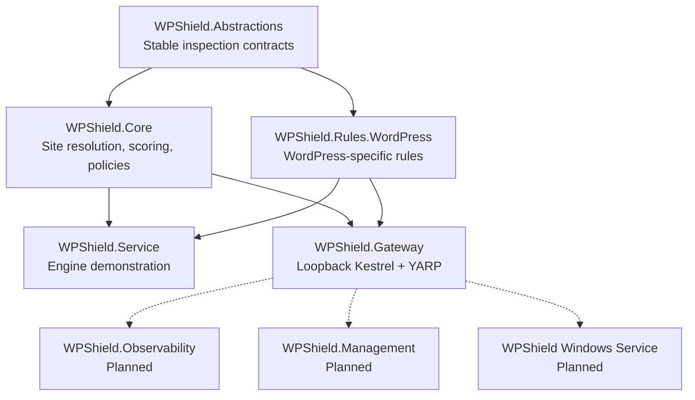
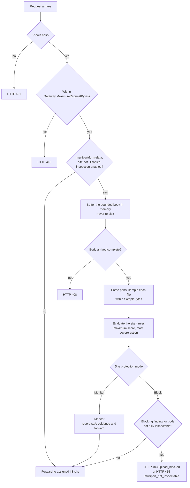
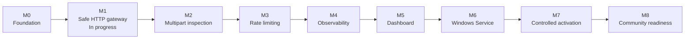

<div align="center">

# WPShield

**WPShield — Windows Power Shield.** An open-source security gateway for Windows Server and IIS.

<sub>The name states a direction. <b>Today the detection rules are WordPress rules</b>; the preflight,
the installer, the host triage and the rate limiter are not. <a href="docs/en/adr/0004-what-wpshield-stands-for.md">ADR 0004</a>
records the gap and what closes it.</sub>

**[See how it works →](https://peopleworks.github.io/WPShield/)**

[](https://github.com/peopleworks/WPShield/actions/workflows/build.yml)
[](ROADMAP.md)
[](LICENSE)
[](https://dotnet.microsoft.com/)
[](https://learn.microsoft.com/iis/)
[](https://wordpress.org/)
[](https://github.com/peopleworks/WPShield/stargazers)
[](https://mvp.microsoft.com/en-US/mvp/profile/24060a02-dbc6-44ec-bca5-c213ff9835c5)

[What a finding looks like](#what-a-finding-looks-like) · [Architecture](#architecture) · [How it compares](#how-it-compares) · [Getting started](#getting-started) · [Roadmap](#roadmap) · [Contributing](#contributing) · [Security](SECURITY.md) · [Español](docs/es/)

<picture>
  <source media="(prefers-color-scheme: dark)" srcset="https://raw.githubusercontent.com/peopleworks/WPShield/main/assets/hero-dark.svg">
  
</picture>

<sub>Neither finding blocks on its own. 50 + 30 reaching the threshold is the design, and the verdict is a rule ID, a score and the evidence behind it.</sub>

</div>

> [!IMPORTANT]
> WPShield is an early research preview. Do not place it in front of a production site yet. During M1 and M2, the gateway must remain bound to loopback and must not replace public IIS bindings.

## What a finding looks like

WPShield's claim is that a decision can be explained. Every finding carries a stable rule ID, a score, a message key and the minimal evidence behind it, so an operator can argue with it rather than trust it.

<details open>
<summary><b>A worked example</b> — one upload named <code>invoice.php.jpg</code>, and one named <code>web.config</code></summary>

Both arrive at a WordPress upload endpoint on a site running in `Monitor` mode with the default thresholds: observe at 30, block at 80.

```http
POST /wp-admin/async-upload.php HTTP/1.1
Host: wordpress-one.example
Content-Type: multipart/form-data; boundary=----WPShieldExample

------WPShieldExample
Content-Disposition: form-data; name="async-upload"; filename="invoice.php.jpg"
Content-Type: image/jpeg
```

**First the name is normalized.** Rules never see the raw client value:

| Submitted | Reaches disk as | Extension segments | Anomalies removed |
| --- | --- | --- | --- |
| `invoice.php.jpg` | `invoice.php.jpg` | `php`, `jpg` | none |
| `web.config` | `web.config` | `config` | none |

**Then the rules run and their scores are summed**, capped at 100:

```json
{
  "SiteId": "wordpress-one",
  "Score": 80,
  "RecommendedAction": "Observe",
  "Findings": [
    {
      "RuleId": "WP-UPLOAD-001",
      "Score": 50,
      "MessageKey": "Findings.ExecutableUploadExtension",
      "Evidence": {
        "extension": ".php",
        "position": "embedded",
        "normalizedName": "invoice.php.jpg"
      }
    },
    {
      "RuleId": "WP-UPLOAD-002",
      "Score": 30,
      "MessageKey": "Findings.DisguisedUploadExtension",
      "Evidence": {
        "executableExtension": ".php",
        "presentedExtension": ".jpg",
        "normalizedName": "invoice.php.jpg"
      }
    }
  ]
}
```

`web.config` needs one rule and no arithmetic:

```json
{
  "SiteId": "wordpress-one",
  "Score": 100,
  "RecommendedAction": "Observe",
  "Findings": [
    {
      "RuleId": "IIS-CONFIG-001",
      "Score": 100,
      "MessageKey": "Findings.IisConfigurationUpload",
      "Evidence": { "normalizedName": "web.config" }
    }
  ]
}
```

Four things worth noticing, because they are the whole point:

1. **`RecommendedAction` is `Observe`, not `Block`, and the score is not what decided that.** The site is in `Monitor` mode. The same two requests against a site configured with `"Mode": "Block"` return `Block`, at 80 and at 100 respectively. Monitor is the default; blocking is a per-site decision an operator makes deliberately.
2. **`.php` in a non-final position scores 50, not 90.** `invoice.php.jpg` is not executable everywhere — it is executable under a PHP-FastCGI installation with `cgi.fix_pathinfo` enabled, or an IIS handler mapping that matches on a wildcard. That single weak signal does not reach the threshold on its own; it takes the disguise finding on the same name to get there.
3. **`web.config` is the Windows-specific one.** IIS reads it from every directory it serves. Writing one into `wp-content/uploads` can register a handler mapping, re-enable script execution an operator disabled, or relax authorization for the directory — remote code execution without uploading a script at all. A rule set written for Linux hosting has no reason to look for it.
4. **A benign `readme.php.txt` scores exactly 80 as well**, and cannot be told apart from `invoice.php.jpg` by name alone. That is why the project's advice is to stay in `Monitor` and read your own upload traffic before switching any site to `Block`. `archive.tar.gz`, `style.min.css` and `holiday.jpg` score 0 and produce no findings at all.

**Run it yourself.** The shipped demonstration submits a third, deliberately evasive synthetic name — `..\..\photo.php.jpg.` — with a harmless PHP marker in the sample:

```powershell
dotnet run --project src/WPShield.Service
```

```json
{
  "SiteId": "wordpress-one",
  "Score": 100,
  "RecommendedAction": "Observe",
  "Findings": [
    { "RuleId": "WP-UPLOAD-001", "Score": 50, "MessageKey": "Findings.ExecutableUploadExtension",
      "Evidence": { "extension": ".php", "position": "embedded", "normalizedName": "photo.php.jpg" } },
    { "RuleId": "WP-UPLOAD-002", "Score": 30, "MessageKey": "Findings.DisguisedUploadExtension",
      "Evidence": { "executableExtension": ".php", "presentedExtension": ".jpg", "normalizedName": "photo.php.jpg" } },
    { "RuleId": "FILE-NAME-001", "Score": 60, "MessageKey": "Findings.UnsafeUploadFileName",
      "Evidence": { "anomalies": "pathSeparator,trailingDotsOrSpaces", "normalizedName": "photo.php.jpg" } },
    { "RuleId": "PHP-CONTENT-001", "Score": 75, "MessageKey": "Findings.PhpTagInUpload", "Evidence": null }
  ]
}
```

The directory prefix and the trailing dot are reported by `FILE-NAME-001` and then discarded. Evidence always carries the normalized name, never the raw one, so a name carrying control characters cannot reach a log consumer intact.

</details>

> [!NOTE]
> The JSON above is the inspection engine's own output — the last block is what the console demonstration prints. The same rules now run on gateway traffic too: a `multipart/form-data` request is buffered within the request limit, each file part is reduced to a bounded name and a bounded leading sample, every rule is evaluated, and the request is forwarded or refused according to the site's mode. Nothing else is inspected — urlencoded forms, JSON, XML-RPC and `application/octet-stream` PUTs stream through untouched. See [bounded multipart inspection](docs/en/m2-multipart-inspection.md) and the [project status](#project-status) table.

## Why WPShield?

WordPress installations on Windows Server need a protection layer that understands both WordPress upload behavior and IIS hosting. WPShield is being built to inspect requests before they reach IIS, PHP, or WordPress while preserving multi-site isolation, operator control, and useful evidence.

<picture>
  <source media="(prefers-color-scheme: dark)" srcset="https://raw.githubusercontent.com/peopleworks/WPShield/main/docs/assets/iis-gap-dark.svg">
  
</picture>

<sub>The gap is not that Linux-oriented rules are weak. It is that the surface they were written against is a different surface.</sub>

WPShield aims to:

- Protect one or many WordPress sites hosted on the same Windows Server.
- Route each hostname only to its explicitly configured IIS destination.
- Detect executable uploads, disguised PHP content, and file-type mismatches.
- Inspect bounded request data without storing suspicious uploads.
- Start safely in **Monitor** mode and require explicit per-site activation of **Block** mode.
- Produce explainable findings with stable rule IDs instead of opaque verdicts.
- Keep security rules, user-facing messages, and documentation extensible and multilingual.
- Complement Microsoft Defender and normal WordPress hardening practices.

WPShield is **not** an antivirus, EDR, stored-file malware scanner, replacement for Microsoft Defender, WordPress patching solution, or volumetric DDoS mitigation service.

## Project status

| Capability | Status | Notes |
| --- | --- | --- |
| .NET 10 foundation and CI | Available | Nullable reference types, warnings as errors, central package management, CodeQL, formatting gate, Linux verification of the portable core, 475 tests |
| Multi-site host resolution | Available | Unknown hosts fail closed; no default backend |
| Explainable inspection engine | Available | Stable rule IDs, scoring, Monitor/Block action calculation |
| WordPress and IIS upload rules | Available | Windows-aware file name normalization, PHP and IIS executable extensions, `web.config` detection, disguised extensions, structural anomalies, file-signature mismatch, image/PHP polyglots |
| Loopback HTTP gateway | Prototype | Kestrel and YARP on `127.0.0.1:10000` |
| Gateway hardening | Available | Strict startup validation, safe 502 failures, and real synthetic multi-site integration coverage |
| Bounded request controls | Available | 6 MiB default, 64 MiB ceiling, early and streamed HTTP 413 enforcement |
| **Bounded multipart inspection** | **Available** | **The rules now run on gateway traffic.** `multipart/form-data` bodies are buffered in memory within the request limit — never to disk — inspected, then forwarded or refused. Bounded file, field, part-header, boundary, file-name and read-timeout limits, each with a ceiling configuration cannot raise |
| Inspection of non-multipart bodies | Planned | Nothing else is inspected: urlencoded forms, JSON, XML-RPC, `application/octet-stream` PUTs and other `multipart/*` subtypes stream through untouched |
| Inspection of archive contents | Planned | A `.zip` plugin or theme carrying a webshell is not detected, and plugin installation is a genuine upload path. No milestone assigned |
| Bound on concurrent buffered uploads | Planned | M3. Nothing limits how many bodies may be buffered at once; loopback-only is currently what bounds that memory |
| Rate limiting and observability | Planned | M3 and M4 |
| Dashboard and Windows Service | Planned | M5 and M6 |
| Production activation | Not approved | Requires M1-M6 validation and controlled M7 rollout |

See the detailed [roadmap](ROADMAP.md) and [threat model](THREAT_MODEL.md) before evaluating or contributing to the project.

## Architecture

WPShield separates reusable inspection contracts and rules from HTTP hosting concerns.



### How a request finds its site

The current gateway is intended only for local testing. Public traffic continues to use the existing IIS bindings on ports 80 and 443, which WPShield never touches.

<picture>
  <source media="(prefers-color-scheme: dark)" srcset="https://raw.githubusercontent.com/peopleworks/WPShield/main/docs/assets/host-resolution-dark.svg">
  
</picture>

<sub>No default entry and no wildcard. A host WPShield does not know has nowhere to go, and a host claimed twice is a startup failure rather than a silent last-one-wins.</sub>

### How a request is inspected

Every stage below runs today. The three conditions in the second decision are what keep ordinary page
traffic on the unbuffered path it has always taken: a request that is not `multipart/form-data`, or
that belongs to a `Disabled` site, or that arrives while `Gateway:Multipart:Enabled` is `false`, never
allocates a buffer at all.



## Security model

The following are project invariants:

- **Monitor by default.** Blocking requires explicit per-site configuration.
- **Fail closed for unknown hosts.** WPShield has no fallback destination.
- **Loopback-only during M1 and M2.** Gateway and management listeners are not public.
- **Untrusted forwarding headers are replaced.** Internet-provided `X-Forwarded-*` values are never trusted.
- **Bounded processing.** Request sizes, streams, samples, multipart sections, headers, and timeouts must have limits.
- **No suspicious upload persistence.** Upload inspection must not create temporary malware collections on disk.
- **Privacy-safe evidence.** Logs must exclude credentials, authorization values, cookies, nonces, tokens, complete query strings, request bodies, and upload content.
- **Explainable decisions.** Findings retain a stable rule ID, score, message key, minimal evidence, and recommended action.
- **No automatic production changes.** WPShield does not modify IIS, DNS, certificates, firewall rules, Windows services, or public ports automatically.

Read [THREAT_MODEL.md](THREAT_MODEL.md) for protected assets, trust boundaries, threats, and required safeguards. Report vulnerabilities according to [SECURITY.md](SECURITY.md), never through a public issue.

## Current rules

Rules match against a Windows-aware normalization of the file name rather than the raw client value, because `shell.php.`, `shell.php `, `shell.php::$DATA` and `..\..\shell.php` all reach disk as `shell.php`.

| Rule ID | Signal | Score |
| --- | --- | --- |
| `IIS-CONFIG-001` | Upload named `web.config`, which is remote code execution on IIS | 100 |
| `WP-UPLOAD-001` | PHP-executable extension in any position | 90 final, 50 embedded |
| `IIS-UPLOAD-001` | IIS-executable extension (`.aspx`, `.ashx`, `.asmx`, …) in any position | 90 final, 50 embedded |
| `PHP-CONTENT-002` | Valid image signature with PHP source proven to sit past the image's own data — the `GIF89a;` polyglot that defeats `getimagesize()` | 85 |
| `PHP-CONTENT-001` | `<?php` or `<?=` in a bounded upload sample | 75 |
| `FILE-TYPE-001` | Final extension claims one format and the leading bytes carry another | 70 script text, 70 `MZ`/ELF, 40 plain text |
| `FILE-NAME-001` | Path separator, alternate data stream, trailing dots or spaces, control character, reserved device name, excessive length | 60 |
| `WP-UPLOAD-002` | Executable extension disguised behind a benign one, such as `photo.php.jpg` | 30 |

Scores are summed within one file and capped at 100; the default thresholds are 30 to observe and 80 to block. Across several files in one request the gateway takes the maximum, never the sum, so twenty benign files cannot add up to a refusal. `IIS-CONFIG-001` and `IIS-UPLOAD-001` cover a Windows attack surface that protection layers written for Linux hosting do not address.

These rules now run on gateway traffic for `multipart/form-data` requests — see [bounded multipart inspection](docs/en/m2-multipart-inspection.md) for what is parsed, what is sampled, and what each mode answers with. `FILE-TYPE-001` deliberately never fires on the declared `Content-Type`, because browsers derive it from the same extension and every non-browser client legitimately sends `application/octet-stream`. Each rule documents its own false positives in [upload rules](docs/en/m2-upload-rules.md); future rules must include benign tests, false-positive analysis, safe evidence, and English and Spanish documentation.

## How it compares

An evaluator is choosing between real, shipping alternatives. The table below compares **design position**, not measured detection rates: WPShield has not been benchmarked against any of these products, and it would be dishonest to imply otherwise.

| | WPShield | WordPress security plugins<br/>(Wordfence, Sucuri, …) | ModSecurity + OWASP CRS | Cloudflare / Azure Front Door WAF |
| --- | --- | --- | --- | --- |
| **Where it runs** | Reverse proxy on the Windows host, ahead of IIS and PHP | Inside WordPress as PHP; some can also run as a PHP prepend ahead of WordPress | Web-server module, ahead of the application | Upstream, before traffic reaches your network |
| **Production-ready today** | **No — research preview, loopback only** | Yes | Yes | Yes |
| **Windows and NTFS file name collapse** | Every rule matches the normalized name | Not part of the documented model; these products target Linux and Apache hosting | The Core Rule Set is written for Linux hosting | Not applicable — no view of the filesystem |
| **IIS handler mappings and `web.config` uploads** | `IIS-CONFIG-001`, `IIS-UPLOAD-001` | Not documented | Not covered by the Core Rule Set | Not applicable |
| **Rule updates** | None. Rules ship in this repository and change by pull request | Vendor threat feed, updated continuously | Core Rule Set releases plus vendor feeds | Managed by the vendor, updated continuously |
| **Volumetric and DDoS protection** | None, and none planned | Limited | None | Yes — this is what they are for |
| **Scanning files already on disk** | None, and out of scope | Yes | No | No |
| **Findings carry a stable ID and evidence** | Yes: rule ID, score, message key, evidence | Varies | Yes, though tuning the Core Rule Set is its own discipline | Vendor event IDs, limited detail |
| **Cost** | Free, MIT | Free tier plus a paid feed | Free and open source | Paid above a free tier |

**Where each of them is stronger than WPShield.** All three are production-ready and have been for years; WPShield is not, and says so on every page it has. Wordfence and its peers carry a threat-intelligence feed, a file scanner, login protection and an install base measured in millions — WPShield has none of that and is not competing for it. ModSecurity with the OWASP Core Rule Set is a mature, widely audited engine covering injection, traversal, protocol anomalies and a great deal more that WPShield does not attempt; its weakness on this platform is deployment, because the IIS module has seen little maintenance and the rules assume Linux hosting. Cloudflare and Azure Front Door absorb volumetric attacks, terminate TLS and filter bots before traffic reaches you at all, which no host-local component can do.

**What WPShield adds is narrow and specific**: a request path on the Windows host that knows how Windows writes a file name, and that `web.config` and `.aspx` are executable there. If you need protection today, deploy one of the products above. WPShield is worth watching if the failure mode you care about is an upload that a Linux-oriented rule set was never written to see.

**IIS Request Filtering is the closest thing already on your server**, it is free, and it should be enabled regardless. It filters the requested URL — extensions, hidden segments, verbs, query length — and it does not read POST bodies, so a `web.config` submitted as a multipart file part through a vulnerable plugin endpoint is not something it inspects. The two are complementary rather than alternatives.

## Getting started

### Prerequisites

- [.NET 10 SDK](https://dotnet.microsoft.com/download)
- Git
- PowerShell
- Windows Server and IIS only when performing the documented local IIS laboratory

Clone and validate the repository:

```powershell
git clone https://github.com/peopleworks/WPShield.git
cd WPShield
dotnet restore WPShield.slnx
dotnet build WPShield.slnx --configuration Release --no-restore
dotnet test WPShield.slnx --configuration Release --no-build
```

The suite is 215 tests across four projects — 59 for the abstractions, 24 for the core, 84 for the rules and 48 for the gateway — and finishes in a few seconds.

### Run the inspection engine demonstration

```powershell
dotnet run --project src/WPShield.Service
```

The output is the JSON shown in [what a finding looks like](#what-a-finding-looks-like). The service loads its default configuration from the compiled application directory. To provide a specific configuration file:

```powershell
dotnet run --project src/WPShield.Service -- src/WPShield.Service/appsettings.json
```

### Run the M1 gateway laboratory

> [!WARNING]
> Run this only on loopback with synthetic or explicitly prepared local backends. Do not expose port 10000 publicly and do not replace IIS ports 80 or 443.

```powershell
dotnet run --project src/WPShield.Gateway
```

The gateway prints its resolved site table before it accepts a request. Read it — it is the only place the effective routing is visible, because configuration is not hot-reloaded:

```text
info: WPShield.Gateway.Configuration[0]
      Gateway configuration resolved 2 site(s).
info: WPShield.Gateway.Configuration[0]
      Configured site. SiteId=wordpress-one Hosts=wordpress-one.example, www.wordpress-one.example Destination=http://127.0.0.1:8081/ Mode=Monitor
info: WPShield.Gateway.Configuration[0]
      Configured site. SiteId=wordpress-two Hosts=wordpress-two.example, www.wordpress-two.example Destination=http://127.0.0.1:8082/ Mode=Monitor
```

Check local health endpoints:

```powershell
curl.exe http://127.0.0.1:10000/_wpshield/health/live
curl.exe http://127.0.0.1:10000/_wpshield/health/ready
```

Test explicit host routing:

```powershell
curl.exe -I -H "Host: wordpress-one.example" http://127.0.0.1:10000/
curl.exe -i -H "Host: unknown.example" http://127.0.0.1:10000/
```

The unknown host must receive HTTP 421. A configured host also needs a matching local backend running at its configured destination; without one it returns HTTP 502, which is the correct answer rather than a fault.

Read the laboratory guide before using IIS:

- [English: M1 laboratory gateway](docs/en/m1-lab-gateway.md)
- [Español: Gateway M1 de laboratorio](docs/es/m1-gateway-laboratorio.md)

## Configuration

The gateway reads `Gateway` and `Sites` sections from `src/WPShield.Gateway/appsettings.json`. That file ships with placeholder hostnames only. Real deployment values belong in `appsettings.Local.json`, which is ignored by git and never copied into a published artifact, or in `WPSHIELD_` environment variables.

```json
{
  "Gateway": {
    "Urls": ["http://127.0.0.1:10000"],
    "AllowRemoteHealthChecks": false,
    "ActivityTimeoutSeconds": 100,
    "MaximumRequestBytes": 6291456,
    "Multipart": {
      "Enabled": true,
      "MaximumFileCount": 20,
      "MaximumFieldCount": 200,
      "MaximumPartHeaderBytes": 16384,
      "SampleBytes": 4096,
      "ReadTimeoutSeconds": 30
    }
  },
  "Sites": [
    {
      "Id": "wordpress-one",
      "Hosts": ["wordpress-one.example", "www.wordpress-one.example"],
      "Destination": "http://127.0.0.1:8081",
      "Mode": "Monitor",
      "ObserveThreshold": 30,
      "BlockThreshold": 80
    }
  ]
}
```

> [!IMPORTANT]
> Configuration is **not** hot-reloaded. Gateway and site options are validated once at startup and captured for the lifetime of the process; editing the file on a running gateway has no effect. The gateway prints its resolved site table on every start — read it to confirm which hosts are actually active. See [operator configuration](docs/en/operator-configuration.md) for the local overlay, the JSON array-merge caveat, and what must never be committed.

| Setting | Purpose |
| --- | --- |
| `Gateway:Urls` | Listener URLs; M1/M2 require loopback IP addresses |
| `Gateway:AllowRemoteHealthChecks` | Keeps health endpoints local when `false` |
| `Gateway:ActivityTimeoutSeconds` | Forwarding activity timeout |
| `Gateway:MaximumRequestBytes` | Absolute per-request body limit; defaults to 6 MiB and cannot exceed 64 MiB. Also the ceiling on the multipart inspection buffer |
| `Gateway:Multipart:Enabled` | Whether multipart bodies are inspected at all. Setting it to `false` returns the gateway to pure streaming and no upload rule runs on live traffic; the gateway warns on every start while it is off |
| `Gateway:Multipart:MaximumFileCount` | File parts inspected per request; defaults to 20 and cannot exceed 100 |
| `Gateway:Multipart:MaximumFieldCount` | Non-file parts counted per request; defaults to 200 and cannot exceed 1000 |
| `Gateway:Multipart:MaximumPartHeaderBytes` | Header bytes allowed on one part; defaults to 16 KiB and cannot exceed 32 KiB |
| `Gateway:Multipart:SampleBytes` | Leading bytes kept per file for the content rules; defaults to 4096, cannot exceed 64 KiB, and **cannot go below 512**, under which `FILE-TYPE-001` and `PHP-CONTENT-002` can no longer decide |
| `Gateway:Multipart:ReadTimeoutSeconds` | Deadline covering the whole inspection read; defaults to 30 and cannot exceed 120 |
| `Sites[].Id` | Stable site identifier used by routing and findings |
| `Sites[].Hosts` | Explicit hostnames assigned to this site |
| `Sites[].Destination` | Site-specific loopback IIS or synthetic backend |
| `Sites[].Mode` | `Monitor`, `Block`, or `Disabled`; use `Monitor` for evaluation |
| `ObserveThreshold` / `BlockThreshold` | Score thresholds used by action calculation |

M1.1 validates that sites exist, hosts are unique, listeners and destinations are safe, and destinations cannot point back to WPShield. Use only loopback destinations in the laboratory.

Every `Gateway:Multipart` value is validated the same way: an out-of-range setting **prevents startup** rather than being silently clamped, because an operator who asks for `"MaximumFileCount": 100000` and quietly gets 100 has been told nothing. The gateway prints the bounds it will actually enforce alongside its resolved site table on every start.

## What each response means

The gateway produces a response of its own in seven situations. Everything else comes from the backend site and is forwarded unchanged. `403`, `408` and `415` are new with bounded multipart inspection.

| Status | When | Body |
| --- | --- | --- |
| `421 Misdirected Request` | The `Host` header matches no configured site. There is no default backend, so this is the fail-closed path. | `{"error":"unknown_host","requestId":"…"}` |
| `403 Forbidden` | A site in `Block` mode received an upload whose findings reached its block threshold. Never produced in `Monitor`. | `{"error":"upload_blocked","requestId":"…","ruleIds":["…"]}` |
| `415 Unsupported Media Type` | A site in `Block` mode received a `multipart/form-data` body WPShield could not fully inspect — a boundary it refuses to parse, a body that is not valid multipart, or a file, field, header or name limit that stopped the read. `Monitor` forwards it intact and logs a warning instead. | `{"error":"multipart_not_inspectable","requestId":"…","reason":"malformed"|"limit_exceeded","ruleIds":["GATEWAY-MULTIPART-001"]}` |
| `408 Request Timeout` | The body did not fully arrive within `Gateway:Multipart:ReadTimeoutSeconds`. Applies in every mode, `Monitor` included: a half-arrived body is not a finding, and forwarding it would hand WordPress a body shorter than its declared `Content-Length`. | `{"error":"request_timeout","requestId":"…"}` |
| `413 Content Too Large` | The declared `Content-Length` exceeds `Gateway:MaximumRequestBytes`, or a body of unknown length crossed that limit while streaming. | `{"error":"request_too_large","requestId":"…"}` |
| `502 Bad Gateway` | The assigned backend could not be reached, or went quiet for longer than the forwarding activity timeout. Nothing about the backend's failure is echoed to the caller. | `{"error":"backend_unavailable","requestId":"…"}` |
| `404 Not Found` on `/_wpshield/health/*` | A health probe arrived from a non-local caller while `AllowRemoteHealthChecks` is `false`, or the path is not a health endpoint that exists. | — |

A refusal body carries the request identifier and the triggering rule identifiers, and never the raw or normalized file name, the field name, the sample, the evidence, the site identifier, the destination, the score or the thresholds. The identifiers are disclosed because the complete rule catalogue is already published above; the score is withheld because a number turns evasion into hill-climbing, where a binary allow/deny forces a blind search. No `Retry-After` is sent: it would imply a refusal that will in fact not change.

Both health endpoints answer `200` locally: `/_wpshield/health/live` returns `{"status":"live","service":"WPShield.Gateway"}` and `/_wpshield/health/ready` returns `{"status":"ready","sites":2}`. Every response, forwarded or generated, carries an `X-WPShield-Request-ID` correlation header and `X-Content-Type-Options: nosniff`, and every response WPShield generates itself adds `Cache-Control: no-store`. That request ID is generated by WPShield; an inbound one is discarded rather than trusted.

## Troubleshooting

The gateway fails closed at startup rather than running on a configuration it cannot vouch for. Each refusal below is a real message from `GatewayConfigurationValidator`.

| Startup message | What it means |
| --- | --- |
| `M1 laboratory gateway may listen only on a loopback HTTP or HTTPS IP.` | `Gateway:Urls` contains something other than a loopback IP address. Hostnames are rejected too, because a name can resolve anywhere. |
| `Site '<id>' destination must remain on loopback during M1.` | A site points at a non-loopback backend. M1 and M2 are laboratory-only by design. |
| `Site '<id>' destination must not point back to a WPShield listener.` | The destination port matches a listener port, which would be a proxy loop. |
| `Host '<host>' is assigned more than once.` | Two sites claim the same hostname. Routing would be ambiguous, so it is refused rather than resolved by declaration order. |
| `Configuration mixes real hostnames with the documentation placeholders shipped in appsettings.json…` | JSON configuration merges arrays element by element, including the nested `Hosts` array, so a partial `appsettings.Local.json` leaves surplus example hosts active and routable. Declare every site and every host explicitly. See [operator configuration](docs/en/operator-configuration.md). |
| `Gateway:MaximumRequestBytes must be between 1 and 67108864 bytes.` | The per-request limit is zero, negative, or above the 64 MiB ceiling. |
| `At least one site must be configured.` | The `Sites` array is empty. WPShield has no fallback destination by design. |
| `Failed to bind to address http://127.0.0.1:10000: address already in use.` | A gateway is already running. Stop it before starting another; nothing is silently shared. |

Two behaviours that look like defects and are not:

- **Editing `appsettings.json` while the gateway runs changes nothing.** Configuration is read and validated once. Restart the process, then read the resolved site table it prints.
- **A configured host returns `502`.** The site resolved correctly; there is simply no backend listening at its destination. Start the synthetic backend or the IIS site first.

## Before you evaluate this on a server you care about

This is a research preview, so the checklist is the point rather than a formality:

- [ ] The gateway listens on loopback only, and the public IIS bindings on ports 80 and 443 are untouched.
- [ ] Real hostnames, ports and destinations exist only in `appsettings.Local.json`, which git ignores and publish never copies. Nothing real is committed.
- [ ] Every site is in `Monitor`, and stays there until a week of that site's own upload traffic has been reviewed in the logs. `Block` now genuinely refuses requests, so the false positives named in [bounded multipart inspection](docs/en/m2-multipart-inspection.md) stop being log lines and start being refusals.
- [ ] The resolved site table printed at startup was read line by line and matches what you intended to route.
- [ ] The rollback is understood and takes one action: stop the process. Live traffic is unaffected, because the IIS bindings were never changed.
- [ ] Any captured gateway log was checked for credentials, cookies, nonces and full query strings before it was kept or shared.
- [ ] `dotnet test WPShield.slnx --configuration Release` passes on the exact commit being evaluated.
- [ ] You have read [THREAT_MODEL.md](THREAT_MODEL.md) and accept what is **not** covered.

## Repository layout

```text
WPShield/
|-- src/
|   |-- WPShield.Abstractions/       Stable inspection contracts
|   |-- WPShield.Core/               Site resolution and rule evaluation
|   |-- WPShield.Rules.WordPress/    WordPress-focused defensive rules
|   |-- WPShield.Service/            Inspection engine demonstration
|   |-- WPShield.Logging/            JSON Lines file logging, kept out of the gateway
|   `-- WPShield.Gateway/            Loopback-only M1 HTTP gateway
|-- tests/                            xUnit test projects, 1058 tests
|-- scripts/                          Read-only operator scripts: triage, IIS validation
|-- assets/                           Hero and social images
|-- docs/
|   |-- assets/                      Light and dark figure pairs
|   |-- en/                          English documentation
|   |   `-- adr/                     Architecture decision records
|   `-- es/                          Documentación en español
|       `-- adr/                     Registros de decisiones de arquitectura
|-- site/                             GitHub Pages landing page
|-- .github/                          CI, templates, and contributor guidance
|-- ROADMAP.md                        Detailed milestone plan
`-- THREAT_MODEL.md                   Security assumptions and safeguards
```

## Roadmap



| Milestone | Goal | Status |
| --- | --- | --- |
| M0 | Foundation, rule contracts, CI, and repository guidance | Complete except the configuration schema and localized validation messages |
| M1 | Hardened loopback multi-site HTTP gateway and synthetic tests | In progress |
| M2 | Bounded request controls, multipart inspection, and high-confidence rules | In progress |
| M3 | Per-site and per-IP rate limiting for sensitive WordPress paths | Planned |
| M4 | Privacy-safe structured events, metrics, rotation, and retention | Planned |
| M5 | Loopback multilingual management dashboard | Planned |
| M6 | Least-privilege Windows Service packaging and signed releases | Planned |
| M7 | Gradual Monitor-first production activation | Planned |
| M8 | Community rule packages and project release readiness | Planned |

The full acceptance criteria and task lists live in [ROADMAP.md](ROADMAP.md).

## Recent security work

WPShield has not been released, so there is no version to summarise. There is, however, a body of closed holes worth surfacing — each one found and fixed in this repository, and each recorded in [CHANGELOG.md](CHANGELOG.md) with the reasoning behind it:

- **Four file name evasions that defeated `WP-UPLOAD-001`.** `shell.php.`, `shell.php `, `shell.php::$DATA` and `photo.php.jpg` all reach disk as executable scripts on Windows and all passed the previous extension check. Rules now match a Windows-aware normalization.
- **`IIS-CONFIG-001`**, which detects a `web.config` upload — an arbitrary file write turned into remote code execution on IIS, with no script involved.
- **`IIS-UPLOAD-001`**, covering the fourteen extensions IIS executes as the application pool identity.
- **The full untrusted forwarding set is now removed**, not three headers: every `X-Forwarded-*` variant, RFC 7239 `Forwarded`, the client-address family, and the path-override headers `X-Original-URL` and `X-Rewrite-URL`, which are authentication-bypass vectors against IIS URL Rewrite.
- **Bounded request bodies**, with early rejection of an oversized `Content-Length` and streamed enforcement for bodies of unknown length.
- **Production topology removed from the public repository**, and startup now fails closed when real hostnames appear beside the shipped placeholders — the signature of a partially applied configuration overlay.

## Documentation

**[The project site](https://peopleworks.github.io/WPShield/)** is the short version. Everything below is the long one.

Operational and architectural documentation is maintained in English and Spanish, and findings are identified by stable message keys rather than baked-in English strings. Root-level project documents are currently English only.

| Topic | English | Español |
| --- | --- | --- |
| Threat model | [Threat model](THREAT_MODEL.md) | [Modelo de amenazas](docs/es/modelo-de-amenazas.md) |
| Architecture | [Architecture](docs/en/architecture.md) | [Arquitectura](docs/es/arquitectura.md) |
| Operator configuration | [Operator configuration](docs/en/operator-configuration.md) | [Configuración del operador](docs/es/configuracion-operador.md) |
| M1 laboratory | [Laboratory gateway](docs/en/m1-lab-gateway.md) | [Gateway de laboratorio](docs/es/m1-gateway-laboratorio.md) |
| M2 request limits | [Bounded request controls](docs/en/m2-request-limits.md) | [Controles limitados de solicitud](docs/es/m2-limites-solicitud.md) |
| M2 multipart inspection | [Bounded multipart inspection](docs/en/m2-multipart-inspection.md) | [Inspección multipart acotada](docs/es/m2-inspeccion-multipart.md) |
| M2 upload rules | [Upload rules](docs/en/m2-upload-rules.md) | [Reglas de carga](docs/es/m2-reglas-carga.md) |
| M2.5 request path inspection | [Request path inspection](docs/en/m2-5-request-path-inspection.md) | [Inspección de la ruta de la solicitud](docs/es/m2-5-inspeccion-ruta-solicitud.md) |
| Triage tool | [Triage tool](docs/en/triage-tool.md) | [Herramienta de triage](docs/es/herramienta-de-triage.md) |
| Preflight | [Preflight](docs/en/preflight.md) | [Verificación previa](docs/es/verificacion-previa.md) |
| Deployment | [Deployment](docs/en/deployment.md) | [Despliegue](docs/es/despliegue.md) |
| ADR 0001 — production traffic path | [Production traffic path](docs/en/adr/0001-production-traffic-path.md) | [Ruta de tráfico en producción](docs/es/adr/0001-ruta-de-trafico-en-produccion.md) |
| ADR 0002 — brute-force defence | [Where brute-force defence belongs](docs/en/adr/0002-host-level-brute-force-defence.md) | [Dónde vive la defensa contra fuerza bruta](docs/es/adr/0002-defensa-fuerza-bruta-a-nivel-de-host.md) |
| ADR 0003 — operator tooling | [Operator tooling moves to a .NET CLI](docs/en/adr/0003-operator-tooling-in-dotnet.md) | [Las herramientas de operador pasan a una CLI de .NET](docs/es/adr/0003-herramientas-de-operador-en-dotnet.md) |
| ADR 0004 — name and scope | [What WPShield stands for](docs/en/adr/0004-what-wpshield-stands-for.md) | [Qué significa WPShield](docs/es/adr/0004-que-significa-wpshield.md) |
| ADR 0005 — putting it in the path *(proposed)* | [Putting WPShield in the path](docs/en/adr/0005-putting-wpshield-in-the-path.md) | [Poner WPShield en la ruta](docs/es/adr/0005-poner-wpshield-en-la-ruta.md) |

The [documentation index](docs/README.md) carries the same list, so a reader who opens the folder and a reader who arrives from here see the same set.

Project-wide references:

| Document | What it is for |
| --- | --- |
| [Roadmap](ROADMAP.md) | Milestones, acceptance criteria, and what must be true before production activation |
| [Security policy](SECURITY.md) | How to report a vulnerability, and what counts as one here |
| [Contributing guide](CONTRIBUTING.md) | House style, the rule checklist, and the validation commands |
| [Support](SUPPORT.md) | Where to ask, and what this project will not help with |
| [Changelog](CHANGELOG.md) | Every closed hole, with the reasoning |
| [Notice](NOTICE.md) | Third-party trademarks, and the project's position on defensive use |
| [Code of Conduct](CODE_OF_CONDUCT.md) | Expected behavior, and how to report a problem |

## Contributing

Community contributions are welcome, especially in these areas:

- Safe gateway validation and synthetic integration tests.
- Bounded streaming and multipart parsing.
- Explainable WordPress rules with benign test fixtures.
- False-positive research for legitimate WordPress and plugin behavior.
- English and Spanish documentation and localization.
- Windows Server, IIS, Elementor, and Google Site Kit compatibility testing.
- Privacy-preserving observability and operational guidance.

Before opening a pull request:

1. Read [CONTRIBUTING.md](CONTRIBUTING.md), [SECURITY.md](SECURITY.md), and [AGENTS.md](AGENTS.md).
2. Keep the change focused and defensive.
3. Add or update tests.
4. Document false-positive and operational risks.
5. Update both English and Spanish documentation for user-facing behavior.
6. Run the full validation commands from [Getting started](#getting-started).

By participating, you agree to follow the [Code of Conduct](CODE_OF_CONDUCT.md).

## Related projects

WPShield is one of four PeopleWorks tools. They do not compose into a pipeline — they share a language, a platform and a house style rather than a workflow:

| Project | What it is for |
| --- | --- |
| [**SQLDiff**](https://github.com/peopleworks/SqlSchemaDiff) | Compares two SQL Server databases and writes the migration script that makes one match the other, preserving the rows already in the target. |
| [**SyncJob**](https://github.com/peopleworks/syncjob) | Moves the rows rather than the schema: full-refresh and incremental SQL Server data synchronization, as a CLI command or a Windows Service, with an audit record per run. |
| [**XAF Logic Explainer**](https://github.com/peopleworks/XAFLogicExplainer) | Reads a DevExpress XAF application with Roslyn and tells an AI coding agent what *that* application actually does — entities, controllers, actions, business rules, navigation and Model Editor customizations. |
| **WPShield** *(this repo)* | Inspects HTTP requests before they reach IIS, PHP and WordPress on Windows Server. |

All four are .NET, MIT-licensed, Windows-first, and built by PeopleWorks.

If WPShield ever needs a compose story, its real companions are Microsoft Defender and IIS Request Filtering rather than any of the above — see [how it compares](#how-it-compares).

## License

WPShield is available under the [MIT License](LICENSE). See [NOTICE.md](NOTICE.md) for third-party trademarks and the project's position on defensive use.

## Credits

Created by **Pedro Hernández — PeopleWorks**,
[Microsoft MVP for .NET](https://mvp.microsoft.com/en-US/mvp/profile/24060a02-dbc6-44ec-bca5-c213ff9835c5).

Built on [.NET 10](https://dotnet.microsoft.com/) · [ASP.NET Core and Kestrel](https://learn.microsoft.com/aspnet/core/fundamentals/servers/kestrel) · [YARP](https://github.com/dotnet/yarp), the only third-party component in the request path · [xUnit](https://xunit.net/)

Built for the people who keep WordPress running on Windows Server — *para quienes sostienen WordPress sobre Windows Server e IIS.*

Repo: <https://github.com/peopleworks/WPShield>

<p align="center">
  <sub><b>WPShield</b> • Defensive inspection for WordPress on Windows Server and IIS</sub><br>
  <sub><b>Research preview.</b> Not approved for production traffic — see the <a href="ROADMAP.md">roadmap</a> for what must be true first.</sub><br>
  <sub>© 2026 PeopleWorks</sub>
</p>
