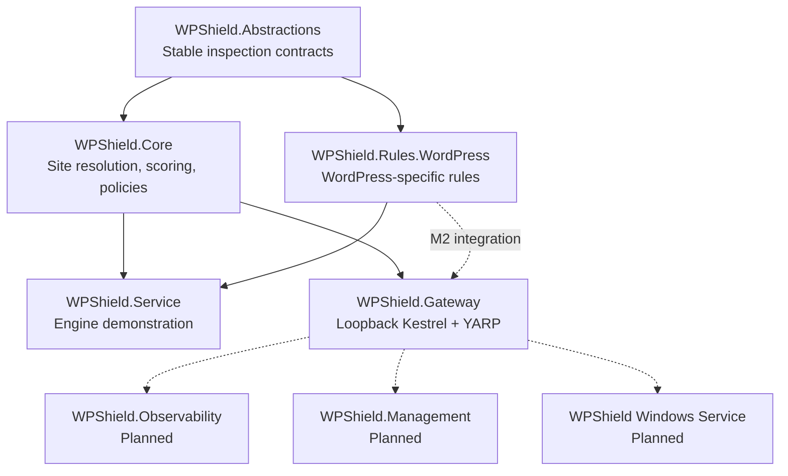
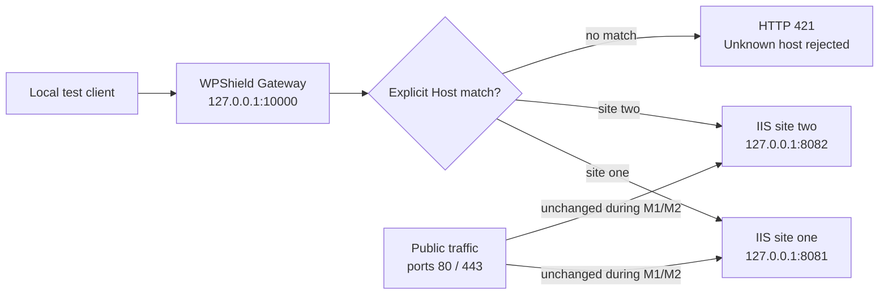
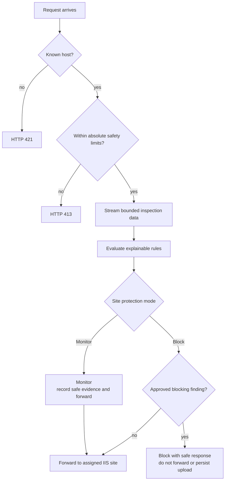
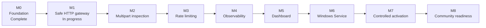

<div align="center">

# WPShield

**An open-source, multilingual security gateway for WordPress on Windows Server and IIS**

[](https://github.com/peopleworks/WPShield/actions/workflows/build.yml)
[](LICENSE)
[](https://dotnet.microsoft.com/)
[](ROADMAP.md)

[Architecture](#architecture) · [Getting started](#getting-started) · [Roadmap](#roadmap) · [Contributing](#contributing) · [Security](SECURITY.md)

</div>

> [!IMPORTANT]
> WPShield is an early research preview. Do not place it in front of a production site yet. During M1 and M2, the gateway must remain bound to loopback and must not replace public IIS bindings.

## Why WPShield?

WordPress installations on Windows Server need a protection layer that understands both WordPress upload behavior and IIS hosting. WPShield is being built to inspect requests before they reach IIS, PHP, or WordPress while preserving multi-site isolation, operator control, and useful evidence.

WPShield aims to:

- Protect one or many WordPress sites hosted on the same Windows Server.
- Route each hostname only to its explicitly configured IIS destination.
- Detect executable uploads, disguised PHP content, and file-type mismatches.
- Inspect bounded request data without storing suspicious uploads.
- Start safely in **Monitor** mode and require explicit per-site activation of **Block** mode.
- Produce explainable findings with stable rule IDs instead of opaque verdicts.
- Keep security rules, user-facing messages, and documentation extensible and multilingual.
- Complement Microsoft Defender and normal WordPress hardening practices.

WPShield is **not** an antivirus, EDR, stored-file malware scanner, replacement for Microsoft Defender, WordPress patching solution, or volumetric DDoS mitigation service.

## Project status

| Capability | Status | Notes |
| --- | --- | --- |
| .NET 10 foundation and CI | Available | Nullable reference types, warnings as errors, central package management |
| Multi-site host resolution | Available | Unknown hosts fail closed; no default backend |
| Explainable inspection engine | Available | Stable rule IDs, scoring, Monitor/Block action calculation |
| Initial WordPress rules | Available | Executable upload extensions and PHP tags in bounded samples |
| Loopback HTTP gateway | Prototype | Kestrel and YARP on `127.0.0.1:10000` |
| Gateway hardening | Available | Strict startup validation, safe 502 failures, and real synthetic multi-site integration coverage |
| Streaming multipart inspection | Planned | M2; not yet connected to gateway traffic |
| Rate limiting and observability | Planned | M3 and M4 |
| Dashboard and Windows Service | Planned | M5 and M6 |
| Production activation | Not approved | Requires M1-M6 validation and controlled M7 rollout |

See the detailed [roadmap](ROADMAP.md) and [threat model](THREAT_MODEL.md) before evaluating or contributing to the project.

## Architecture

WPShield separates reusable inspection contracts and rules from HTTP hosting concerns.



### M1 laboratory topology

The current gateway is intended only for local testing. Public traffic continues to use the existing IIS bindings on ports 80 and 443.



### Target inspection flow

The bounded multipart and rule-evaluation stages shown below are planned for M2 and are not yet active in the gateway.



## Security model

The following are project invariants:

- **Monitor by default.** Blocking requires explicit per-site configuration.
- **Fail closed for unknown hosts.** WPShield has no fallback destination.
- **Loopback-only during M1 and M2.** Gateway and management listeners are not public.
- **Untrusted forwarding headers are replaced.** Internet-provided `X-Forwarded-*` values are never trusted.
- **Bounded processing.** Request sizes, streams, samples, multipart sections, headers, and timeouts must have limits.
- **No suspicious upload persistence.** Upload inspection must not create temporary malware collections on disk.
- **Privacy-safe evidence.** Logs must exclude credentials, authorization values, cookies, nonces, tokens, complete query strings, request bodies, and upload content.
- **Explainable decisions.** Findings retain a stable rule ID, score, message key, minimal evidence, and recommended action.
- **No automatic production changes.** WPShield does not modify IIS, DNS, certificates, firewall rules, Windows services, or public ports automatically.

Read [THREAT_MODEL.md](THREAT_MODEL.md) for protected assets, trust boundaries, threats, and required safeguards. Report vulnerabilities according to [SECURITY.md](SECURITY.md), never through a public issue.

## Current rules

| Rule ID | Signal | Current behavior |
| --- | --- | --- |
| `WP-UPLOAD-001` | Executable PHP-family upload extension | Produces a high-confidence explainable finding |
| `PHP-CONTENT-001` | `<?php` or `<?=` in a bounded upload sample | Produces an explainable content finding |

These rules are available to the inspection engine demonstration. Gateway multipart integration is planned for M2. Future rules must include benign tests, false-positive analysis, safe evidence, and English and Spanish documentation.

## Getting started

### Prerequisites

- [.NET 10 SDK](https://dotnet.microsoft.com/download)
- Git
- PowerShell
- Windows Server and IIS only when performing the documented local IIS laboratory

Clone and validate the repository:

```powershell
git clone https://github.com/peopleworks/WPShield.git
cd WPShield
dotnet restore WPShield.slnx
dotnet build WPShield.slnx --configuration Release --no-restore
dotnet test WPShield.slnx --configuration Release --no-build
```

### Run the inspection engine demonstration

```powershell
dotnet run --project src/WPShield.Service
```

The service loads its default configuration from the compiled application directory. To provide a specific configuration file:

```powershell
dotnet run --project src/WPShield.Service -- src/WPShield.Service/appsettings.json
```

### Run the M1 gateway laboratory

> [!WARNING]
> Run this only on loopback with synthetic or explicitly prepared local backends. Do not expose port 10000 publicly and do not replace IIS ports 80 or 443.

```powershell
dotnet run --project src/WPShield.Gateway
```

Check local health endpoints:

```powershell
curl.exe http://127.0.0.1:10000/_wpshield/health/live
curl.exe http://127.0.0.1:10000/_wpshield/health/ready
```

Test explicit host routing:

```powershell
curl.exe -I -H "Host: wordpress-one.example" http://127.0.0.1:10000/
curl.exe -i -H "Host: unknown.example" http://127.0.0.1:10000/
```

The unknown host must receive HTTP 421. A configured host also needs a matching local backend running at its configured destination.

Read the laboratory guide before using IIS:

- [English: M1 laboratory gateway](docs/en/m1-lab-gateway.md)
- [Español: Gateway M1 de laboratorio](docs/es/m1-gateway-laboratorio.md)

## Configuration

The gateway reads `Gateway` and `Sites` sections from `src/WPShield.Gateway/appsettings.json`. Environment variables with the `WPSHIELD_` prefix and command-line arguments can override configuration.

```json
{
  "Gateway": {
    "Urls": ["http://127.0.0.1:10000"],
    "AllowRemoteHealthChecks": false,
    "ActivityTimeoutSeconds": 100
  },
  "Sites": [
    {
      "Id": "wordpress-one",
      "Hosts": ["wordpress-one.example", "www.wordpress-one.example"],
      "Destination": "http://127.0.0.1:8081",
      "Mode": "Monitor",
      "ObserveThreshold": 30,
      "BlockThreshold": 80
    }
  ]
}
```

| Setting | Purpose |
| --- | --- |
| `Gateway:Urls` | Listener URLs; M1/M2 require loopback IP addresses |
| `Gateway:AllowRemoteHealthChecks` | Keeps health endpoints local when `false` |
| `Gateway:ActivityTimeoutSeconds` | Forwarding activity timeout |
| `Sites[].Id` | Stable site identifier used by routing and findings |
| `Sites[].Hosts` | Explicit hostnames assigned to this site |
| `Sites[].Destination` | Site-specific loopback IIS or synthetic backend |
| `Sites[].Mode` | `Monitor`, `Block`, or `Disabled`; use `Monitor` for evaluation |
| `ObserveThreshold` / `BlockThreshold` | Score thresholds used by action calculation |

M1.1 validates that sites exist, hosts are unique, listeners and destinations are safe, and destinations cannot point back to WPShield. Use only loopback destinations in the laboratory.

## Repository layout

```text
WPShield/
|-- src/
|   |-- WPShield.Abstractions/       Stable inspection contracts
|   |-- WPShield.Core/               Site resolution and rule evaluation
|   |-- WPShield.Rules.WordPress/    WordPress-focused defensive rules
|   |-- WPShield.Service/            Inspection engine demonstration
|   `-- WPShield.Gateway/            Loopback-only M1 HTTP gateway
|-- tests/                            xUnit test projects
|-- docs/
|   |-- en/                          English documentation
|   `-- es/                          Documentación en español
|-- .github/                         CI, templates, and contributor guidance
|-- ROADMAP.md                       Detailed milestone plan
`-- THREAT_MODEL.md                  Security assumptions and safeguards
```

## Roadmap



| Milestone | Goal | Status |
| --- | --- | --- |
| M0 | Foundation, rule contracts, CI, and repository guidance | Complete |
| M1 | Hardened loopback multi-site HTTP gateway and synthetic tests | In progress |
| M2 | Bounded streaming multipart inspection and high-confidence rules | Planned |
| M3 | Per-site and per-IP rate limiting for sensitive WordPress paths | Planned |
| M4 | Privacy-safe structured events, metrics, rotation, and retention | Planned |
| M5 | Loopback multilingual management dashboard | Planned |
| M6 | Least-privilege Windows Service packaging and signed releases | Planned |
| M7 | Gradual Monitor-first production activation | Planned |
| M8 | Community rule packages and project release readiness | Planned |

The full acceptance criteria and task lists live in [ROADMAP.md](ROADMAP.md).

## Documentation

| Topic | English | Español |
| --- | --- | --- |
| Architecture | [Architecture](docs/en/architecture.md) | [Arquitectura](docs/es/arquitectura.md) |
| M1 laboratory | [Laboratory gateway](docs/en/m1-lab-gateway.md) | [Gateway de laboratorio](docs/es/m1-gateway-laboratorio.md) |

Project-wide references:

- [Roadmap](ROADMAP.md)
- [Threat model](THREAT_MODEL.md)
- [Security policy](SECURITY.md)
- [Contributing guide](CONTRIBUTING.md)
- [Code of Conduct](CODE_OF_CONDUCT.md)

## Contributing

Community contributions are welcome, especially in these areas:

- Safe gateway validation and synthetic integration tests.
- Bounded streaming and multipart parsing.
- Explainable WordPress rules with benign test fixtures.
- False-positive research for legitimate WordPress and plugin behavior.
- English and Spanish documentation and localization.
- Windows Server, IIS, Elementor, and Google Site Kit compatibility testing.
- Privacy-preserving observability and operational guidance.

Before opening a pull request:

1. Read [CONTRIBUTING.md](CONTRIBUTING.md), [SECURITY.md](SECURITY.md), and [AGENTS.md](AGENTS.md).
2. Keep the change focused and defensive.
3. Add or update tests.
4. Document false-positive and operational risks.
5. Update both English and Spanish documentation for user-facing behavior.
6. Run the full validation commands from [Getting started](#getting-started).

By participating, you agree to follow the [Code of Conduct](CODE_OF_CONDUCT.md).

## License

WPShield is available under the [MIT License](LICENSE).

---

<div align="center">

Built for safer WordPress hosting on Windows Server and IIS.

</div>
