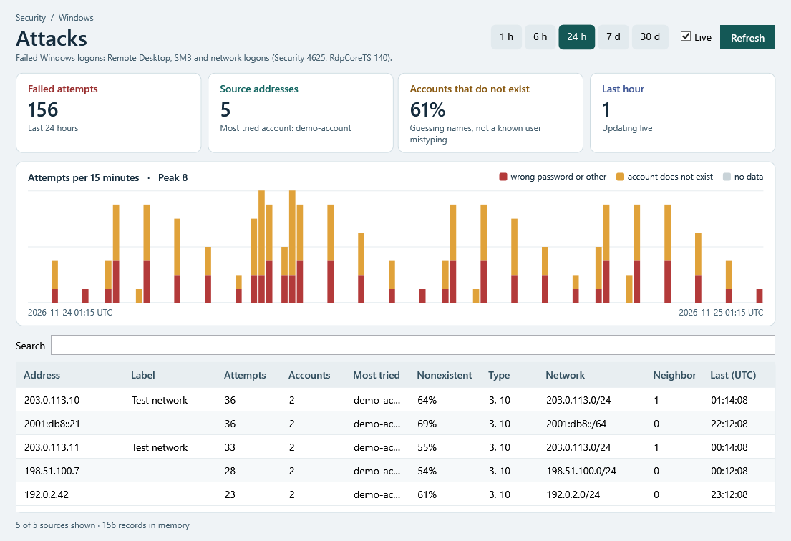
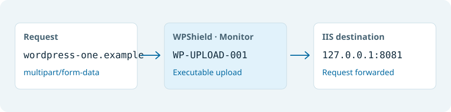
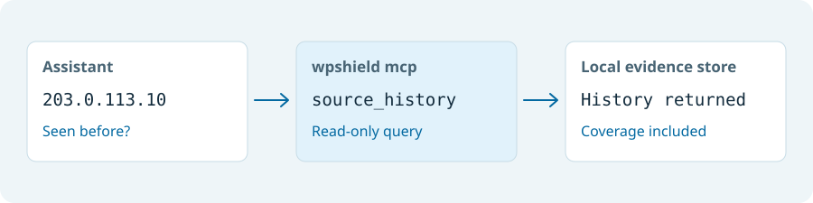

# WPShield

WPShield (Windows Power Shield) watches IIS and WordPress sites on Windows Server so you can see the requests that reach your sites, follow failed logons to the host and ask an assistant about the recorded evidence.

> [!IMPORTANT]
> **Research preview. WPShield is not approved for production traffic.** Keep the gateway on loopback during M1 and M2 and leave public IIS bindings in place.

[Attacks on the host](#attacks-on-the-host) · [Requests to the sites](#requests-to-the-sites) · [Ask about it](#ask-about-it) · [Español](docs/es/)

## Attacks on the host

The desktop’s **Attacks** view shows failed RDP, SMB and other network logons from the last 24 hours and updates live. The **7 d** and **30 d** views use the evidence store. Address labels help identify known sources in the desktop and in `wpshield attacks`. [Attacks guide](docs/en/network-sensor-design.md#attacks)



## Requests to the sites

In the lab, the gateway sits in front of IIS and runs in **Monitor** by default. It records findings for executable uploads, `web.config` and suspicious request paths. [Gateway reference](docs/en/gateway-reference.md)

<picture>
  <source media="(prefers-color-scheme: dark)" srcset="docs/assets/site-requests-dark.svg">
  
</picture>

## Ask about it

Use the read-only `wpshield mcp` server with Claude Desktop or Claude Code to ask about failed logons, source history and gaps in recorded evidence. [MCP setup and what leaves the host](docs/en/mcp-server.md)

<picture>
  <source media="(prefers-color-scheme: dark)" srcset="docs/assets/ask-evidence-dark.svg">
  
</picture>

## Quick start

1. Download the research-preview ZIP and matching `.sha256` file from [Releases](https://github.com/peopleworks/WPShield/releases) when available. The CLI steps require `wpshield.exe`. If Releases is empty or offers only the gateway, [build the gateway and CLI together on a machine with the SDK](docs/en/operator-reference.md#build-the-release-to-carry-to-the-server).
2. Replace `preview.zip` with the archive’s filename. Compare the displayed hash with the matching `.sha256` file before extracting.

   ```powershell
   Get-FileHash -LiteralPath .\preview.zip -Algorithm SHA256
   ```

3. On the lab host, open an elevated PowerShell session in the extracted folder. Run the read-only preflight and review its report before evaluating the gateway.

   ```powershell
   .\wpshield.exe preflight
   ```

4. To watch live logons from a source checkout on the lab host, start the desktop from an elevated prompt and open **Attacks**.

   ```powershell
   dotnet run --project src/WPShield.Desktop -c Release
   ```

   Or, from the extracted folder, collect from an elevated prompt while the WPShield service is stopped or absent. Run the query in a second elevated prompt after evidence is recorded. If the service is already collecting, use the query by itself.

   ```powershell
   .\wpshield.exe evidence collect
   .\wpshield.exe attacks --range 24h
   ```

## Current limits

- Host-wide WFP blocking is a research preview for disposable Windows Server VMs. Monitor is the default. [Network filter and validation](docs/en/network-filter-design.md)
- Production traffic remains outside the approved scope. During M1 and M2, run the gateway on loopback only.

## Status

| Capability | Status |
| --- | --- |
| Host observation | Desktop Attacks, CLI history and a local evidence store |
| Site request inspection | Loopback gateway with Monitor as the default |
| Assistant queries | Read-only MCP over the local evidence store |
| Validation | Tested in CI |

See the [roadmap](ROADMAP.md) for milestones, validation and production activation criteria.

## Documentation and project links

- [Documentation index in English and Spanish](docs/README.md) · [Documentación en español](docs/es/)
- [Project site](https://peopleworks.github.io/WPShield/) · [Changelog](CHANGELOG.md) · [Support](SUPPORT.md)
- [Contributing](CONTRIBUTING.md) · [Code of Conduct](CODE_OF_CONDUCT.md) · [Security policy](SECURITY.md) · [Threat model](THREAT_MODEL.md)
- [MIT License](LICENSE) · [Third-party notices](NOTICE.md) · Created by [Pedro Hernández at PeopleWorks](https://github.com/peopleworks)
