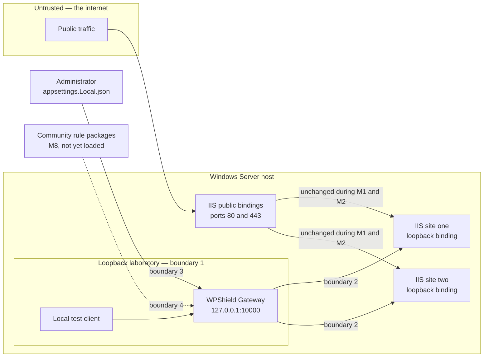

# Threat model

This document states what WPShield defends, against whom, with which control, and — the part that
matters most for a research-stage project — what it does **not** defend yet. Every rule ID, score,
threshold and limit below is a value in the source tree, not an aspiration. If a claim here stops
matching `src/`, the claim is the defect.

> [!IMPORTANT]
> WPShield is an early research preview. Through M1 and M2 the gateway is bound to loopback and is
> not in the path of any real request. Nothing in this document should be read as a statement that a
> production site is currently protected.

## Scope

**In scope.** The HTTP request as it arrives, before it reaches IIS, PHP or WordPress: the hostname
it claims, the forwarding metadata it carries, its size, and — from M2 — the file names and bounded
sample data inside a multipart upload.

**Out of scope, deliberately.** WPShield is **not** an antivirus, **not** an EDR, **not** a
stored-file malware scanner, **not** a replacement for Microsoft Defender, **not** a WordPress
patching solution, and **not** volumetric DDoS mitigation. It never scans, quarantines or deletes a
file on disk, and it has no view of a host that was already compromised. The security of WordPress
core, of third-party plugins and themes, of PHP and of IIS themselves belongs to their vendors; see
[SECURITY.md](SECURITY.md) and [NOTICE.md](NOTICE.md).

A protection layer that claims more than it does is worse than none, because the operator stops
looking elsewhere.

## Assets

| Asset | Why it is worth attacking |
| --- | --- |
| WordPress application files and the upload directories | A single writable file that the web server will execute converts a file-write bug into remote code execution. `wp-content/uploads` is writable by design. |
| Availability of the IIS-hosted sites | These are live business sites. An outage caused by the protection layer is a security failure, not a trade-off. |
| Administrative sessions and request secrets | Cookies, nonces, tokens, authorization headers and full query strings. Disclosing them defeats every other control. |
| Integrity of WPShield configuration and rules | Configuration decides which host reaches which backend and whether a site blocks. A silently wrong configuration is indistinguishable from no protection. |
| Multi-site isolation | Two WordPress sites on one Windows host must not become one blast radius because a proxy routed a request by guesswork. |

## Actors

| Actor | Capability assumed | What they are after |
| --- | --- | --- |
| **Malicious uploader** | Can reach an upload endpoint — a vulnerable plugin, a compromised subscriber account, an unauthenticated media handler — and fully controls the file name, declared content type and body. | A file the server will execute. |
| **Automated scanner** | No credentials. High request volume against `wp-login.php`, `xmlrpc.php`, `admin-ajax.php` and known plugin paths. | Credentials, an unpatched plugin, an enumerable surface. |
| **Host-header attacker** | Controls every request header, including `Host`, and can address the gateway directly. | Reaching a site the operator did not assign to that hostname, or being routed to a default backend that should not exist. |
| **Header-spoofing client** | Controls `X-Forwarded-*`, `Forwarded`, `X-Real-IP`, `X-Original-URL` and the rest of the forwarding family. | Being seen as a trusted address, or making IIS URL Rewrite resolve a different path than the one that was inspected. |
| **Misconfiguring operator** | Full administrative control, benign intent, limited time. Most likely to edit configuration under pressure during an incident. | Nothing. This actor is in the model because the most probable way WPShield fails is that it was configured to do something its operator did not intend. |
| **Rule package author (M8)** | Ships code that the inspection engine loads and runs in the request path. | In the honest case, better detection. In the dishonest case, everything. |

## Trust boundaries

Today, during M1 and M2, the gateway is a laboratory component. Public traffic never touches it.

1. **Client to gateway.** Everything on the request is attacker-controlled: method, path, `Host`,
   every header, the body and every file name inside it. Nothing arriving here is trusted, without
   exception, for as long as the gateway is the only hop.
2. **Gateway to IIS loopback destination.** The destination is validated at startup to be an absolute
   `http`/`https` loopback URI that is not a WPShield listener port. The gateway rewrites the
   forwarding headers here; what crosses this boundary is what WPShield derived from the connection,
   not what the client sent.
3. **Administrator to configuration.** `appsettings.json` ships documentation placeholders only. Real
   hostnames and destinations live in `appsettings.Local.json`, which is ignored by git and is never
   copied into a published artifact. Whoever can write that file decides where traffic goes.
4. **Community rule packages to the inspection engine.** Not yet crossed — no external rule loading
   exists. Defining it is M8, and the boundary is named here so it is designed rather than discovered.

Under the traffic path decided in
[ADR 0001](docs/en/adr/0001-production-traffic-path.md), M7 adds a fifth boundary: IIS keeps ports 80
and 443 and forwards to the loopback gateway through URL Rewrite and ARR. That inserts a *local
proxy* in front of WPShield and changes boundary 1 — see [T8](#t8--forwarding-header-and-path-override-spoofing).

## How a finding becomes an action

Rules do not block. They report a scored finding, and `InspectionEngine` sums the scores, caps the
total at 100, and compares it against the site's thresholds.

| Setting | Default | Source |
| --- | --- | --- |
| `Mode` | `Monitor` | `SiteOptions.Mode` |
| `ObserveThreshold` | 30 | `SiteOptions.ObserveThreshold` |
| `BlockThreshold` | 80 | `SiteOptions.BlockThreshold` |

A score at or above `BlockThreshold` produces `Block` **only** when the site is explicitly in `Block`
mode; in `Monitor` it produces `Observe`. A score at or above `ObserveThreshold` produces `Observe`.
Anything else is `Allow`, and a `Disabled` site returns `Allow` with a score of zero without
evaluating a rule.

This is why individual scores are calibrated the way they are: a weak signal must not block on its
own, and a combination must. `..\..\photo.php.jpg.` produces four findings — WP-UPLOAD-001 at 50
(embedded, not final), WP-UPLOAD-002 at 30, FILE-NAME-001 at 60, PHP-CONTENT-001 at 75 — summing past
the cap to 100. In the default `Monitor` mode the recommended action is `Observe`, which is what both
`WPShield.Service` and the gateway report for that name today.

## Threats

| # | Threat | Control today | Status |
| --- | --- | --- | --- |
| [T1](#t1--upload-of-a-file-a-php-handler-will-execute) | Upload of a file a PHP handler will execute | `WP-UPLOAD-001` | Shipped, running on multipart traffic |
| [T2](#t2--upload-of-a-file-iis-itself-will-execute) | Upload of a file IIS itself will execute | `IIS-UPLOAD-001` | Shipped, running on multipart traffic |
| [T3](#t3--webconfig-upload-as-remote-code-execution) | `web.config` upload as remote code execution | `IIS-CONFIG-001` | Shipped, running on multipart traffic |
| [T4](#t4--disguised-extension) | Disguised extension (`photo.php.jpg`) | `WP-UPLOAD-002` | Shipped, running on multipart traffic |
| [T5](#t5--windows-write-normalization) | Windows write normalization (`shell.php.`, `shell.php `, `shell.php::$DATA`) | `NormalizedFileName` + `FILE-NAME-001` | Shipped |
| [T6](#t6--executable-content-under-a-harmless-name) | Executable content under a harmless name, and declared-type mismatch | `PHP-CONTENT-001`, `FILE-TYPE-001`, `PHP-CONTENT-002` | Partial — sample-bounded, multipart only |
| [T7](#t7--host-header-confusion-in-a-multi-site-deployment) | Host-header confusion in a multi-site deployment | Explicit host map, HTTP 421 | Shipped |
| [T8](#t8--forwarding-header-and-path-override-spoofing) | Forwarding-header and path-override spoofing | `WPShieldTransformer` header sweep | Shipped |
| [T9](#t9--unbounded-or-oversized-request-bodies) | Unbounded or oversized request bodies | 6 MiB default, 64 MiB ceiling, HTTP 413, bounded multipart structure | Partial — concurrency is unbounded, M3 |
| [T10](#t10--automated-probing-and-repeated-abusive-requests) | Automated probing and repeated abusive requests | None | **Unmitigated — M3** |
| [T11](#t11--secret-disclosure-through-logs-and-evidence) | Secret disclosure through logs and evidence | Logging discipline in code review | Partial — automated tests are M4 |
| [T12](#t12--the-gateway-as-new-attack-surface-and-single-point-of-failure) | The gateway as new attack surface and single point of failure | Fail-closed startup validation, loopback-only, bypass by rule toggle | Partial — M7 |
| [T13](#t13--supply-chain-dependencies-and-community-rule-packages) | Supply chain: dependencies and community rule packages | Pinned versions, CodeQL, SHA-pinned actions | Partial — rule packages are M8 |

---

### T1 — Upload of a file a PHP handler will execute

**The attack.** A vulnerable or over-permissive upload endpoint accepts `shell.php` into
`wp-content/uploads`. Requesting it back runs it.

**Why Windows and IIS differ.** The extension vocabulary is wider than the one a Linux guide lists,
because IIS handler mappings for PHP-FastCGI are commonly registered by wildcard rather than for the
exact documented set. `WP-UPLOAD-001` therefore matches `php`, `php3`, `php4`, `php5`, `php7`,
`php8`, `phps`, `pht`, `phtm`, `phtml` and `phar`.

**Control.** `WP-UPLOAD-001` — 90 when the executable extension is the final one, 50 when it is
embedded. Matching runs over **every** extension segment of the normalized name, not only the last.

**Unmitigated.** The rule runs on gateway traffic as of M2, so what is left is the rule's own reach
rather than a wiring gap. Only `multipart/form-data` bodies are inspected, so the same file arriving
in a JSON, urlencoded or `application/octet-stream` request passes untouched. An extension this
vocabulary does not list, or a handler mapping the operator added themselves, is not detected. A file named
`shell.php` on a site with no PHP handler mapping at all is a false positive by design — the rule
reports the name, not the server configuration.

### T2 — Upload of a file IIS itself will execute

**The attack.** An `.aspx` or `.ashx` file dropped into a writable uploads directory runs as the
application pool identity.

**Why Windows and IIS differ.** This is the gap WPShield exists to close. A protection layer written
for Linux hosting has no reason to consider `.aspx` dangerous, and an ASP.NET handler running as the
pool identity is a strictly larger capability than a PHP shell running under FastCGI.

**Control.** `IIS-UPLOAD-001` — 90 final, 50 embedded, over `aspx`, `asp`, `ashx`, `asmx`, `ascx`,
`axd`, `cshtml`, `vbhtml`, `razor`, `svc`, `soap`, `rem`, `asax` and `master`.

**Unmitigated.** Same reach limit as T1 — only `multipart/form-data` is inspected. A site that
legitimately distributes such files as
downloads will produce findings; the guidance is to stay in `Monitor` and record them, not to remove
the rule.

### T3 — `web.config` upload as remote code execution

**The attack.** Write a `web.config` into a served directory. IIS reads it and applies it to that
directory and its children. The attacker can register a handler mapping that executes files of their
choosing, re-enable script execution the operator disabled, or relax authorization — converting an
arbitrary file write into remote code execution **without ever uploading a script**.

**Why Windows and IIS differ.** There is no Linux equivalent that is this direct. `.htaccess` is the
nearest analogue and is usually disabled; `web.config` is read by default, everywhere IIS serves.

**Control.** `IIS-CONFIG-001`, score **100** — the highest-confidence rule WPShield ships, and by
itself past the default block threshold. It matches the exact reserved name after normalization, so
`web.config.`, `WEB.CONFIG`, `web.config::$DATA` and `../web.config` are all recognized. It
deliberately does not match every `.config` extension, so a site distributing an unrelated
configuration file is unaffected.

**Unmitigated.** Only `multipart/form-data` is inspected, so a `web.config` written by a raw
`application/octet-stream` PUT is not seen, and neither is one inside an uploaded plugin or theme
archive, because archive contents are never opened. WPShield sees an upload in flight; it cannot see a `web.config`
that arrived by FTP, by a compromised deployment pipeline, or before WPShield existed. Detecting
those is file-integrity monitoring, which is out of scope.

### T4 — Disguised extension

**The attack.** `photo.php.jpg` presents itself as an image to any check that reads only the last
extension, while remaining executable under a PHP-FastCGI installation with `cgi.fix_pathinfo`
enabled or an IIS handler mapping that matches on a wildcard.

**Control.** `WP-UPLOAD-002`, score **30** — deliberately small. It is a disguise signal, not proof
of execution, and it reaches the block threshold only in combination with `WP-UPLOAD-001` or
`IIS-UPLOAD-001` reporting the same name. That combination is the point: rules combine signals
instead of blocking on a single weak one.

**Unmitigated.** A genuinely benign `readme.php.txt` is structurally identical to a disguised payload
and cannot be separated from it by name alone. Ordinary multi-extension names such as
`archive.tar.gz`, `style.min.css` and `report.2024.xlsx` never match, because the rule requires an
*executable* segment rather than merely more than one segment.

### T5 — Windows write normalization

**The attack.** Submit a name that inspection reads as harmless and that Windows writes to disk as
something else:

| Submitted | Reaches disk as | Mechanism |
| --- | --- | --- |
| `shell.php.` | `shell.php` | Windows strips trailing dots |
| `shell.php ` | `shell.php` | Windows strips trailing spaces |
| `shell.php::$DATA` | `shell.php` | NTFS alternate data stream suffix |
| `..\..\shell.php` | `shell.php`, elsewhere | Directory traversal; only the final segment is a name |
| `shell.p<NUL>hp` | varies | Control characters are discarded by downstream consumers |

**Why Windows and IIS differ.** This is the whole reason `NormalizedFileName` exists. Every row above
is a Windows/NTFS behaviour with no Linux counterpart, and each one defeats a naive check that
compares the submitted string against a deny list.

**Control.** Two layers. First, **rules never match against a raw client-supplied name** — they match
`InspectionContext.NormalizedFile`, which approximates what Windows would actually place on disk.
Second, `FILE-NAME-001` reports the anomalies normalization had to remove: `pathSeparator`,
`alternateDataStream`, `trailingDotsOrSpaces`, `controlCharacter`, `reservedDeviceName` (`CON`,
`PRN`, `AUX`, `NUL`, `COM1`–`COM9`, `LPT1`–`LPT9`), `excessiveLength` (over 255 UTF-16 units) and
`emptyAfterNormalization`. Its score is **60** — below the block threshold on purpose, because some
browsers and legacy clients submit a full local path and would otherwise be blocked. Combined with an
executable-extension finding it clears the threshold, which is the intended outcome for
`../../shell.php.`.

**Unmitigated.** Relying on WordPress to call `sanitize_file_name()` is not a control: the vulnerable
plugin endpoints that cause upload incidents are exactly the ones that write files without it.
Evidence records the anomaly kinds and the normalized result, never the raw name, so a log consumer
cannot be attacked through the evidence — but that also means the raw name is not available for
forensics.

### T6 — Executable content under a harmless name

**The attack.** The name is unremarkable; the bytes are not. A polyglot image with a PHP prologue, or
a file whose declared `Content-Type` contradicts both its name and its contents.

**Control.** Three rules, all reading `InspectionContext.Sample`, which the multipart reader now
fills with the leading `Gateway:Multipart:SampleBytes` — 4096 by default — of each file part.
`PHP-CONTENT-001`, score **75**, matches `<?php` or `<?=` anywhere in that sample. `FILE-TYPE-001`
compares the final extension against the leading bytes and scores **70** for script text, **70** for
an `MZ` or ELF header, and **40** for plain text where a binary format was claimed; none of the three
blocks alone. `PHP-CONTENT-002`, score **85**, blocks alone but fires only on structural proof — a
`getimagesize()`-set signature at offset 0 plus a validated PHP marker that a bounded walk shows lies
after the GIF trailer, after PNG `IEND`, after JPEG `EOI`, or beyond a BMP or RIFF declared length.

**Unmitigated, and the declared-type half of this threat is deliberately not covered.**
`FILE-TYPE-001` never fires on the declared `Content-Type`; it is recorded only as a four-state token
— agrees, disagrees, opaque, absent — and never as a finding. Browsers derive a part's
`Content-Type` from the same extension, and curl, wp-cli, mobile applications and the plupload
fallback all legitimately send `application/octet-stream`, so a rule that fired on that disagreement
would fire on every non-browser client. Content matching also stays bounded to a sample by design —
WPShield never holds a complete upload for inspection — so a marker placed past the sample window is
not seen, and `PHP-CONTENT-002` proves only the minimal-carrier polyglot, because on a real
photograph the JPEG `EOI` sits far past that window. Archive contents are never opened.
`FILE-TYPE-001` is also silent on bytes it does not recognize, which is what keeps it quiet on the
plupload chunks that every upload larger than the request limit must arrive as. The name-based rules,
not the content rules, remain the load-bearing detection.

### T7 — Host-header confusion in a multi-site deployment

**The attack.** Send `Host: wordpress-two.example` to a proxy in front of `wordpress-one.example` and
see which backend answers. Any proxy with a default or fallback backend leaks one site into another's
blast radius.

**Control.** There is **no default backend**. `SiteResolver` builds an explicit, case-insensitive map
from hostname to site; a hostname assigned twice is a startup failure, and an empty hostname is a
startup failure. Host comparison normalizes the trailing dot of an absolute name, strips a port, and
handles bracketed IPv6 literals, so `WordPress-One.Example:10000` and `wordpress-one.example.` resolve
to the same site and nothing else does. An unresolved host is rejected with **HTTP 421
`unknown_host`** before any backend is contacted, and the rejection is logged with the request ID,
host, method and path — never the query string.

**Unmitigated.** Under the M7 path, ARR must preserve the client `Host` header or every request
becomes a 421. ADR 0001 lists that as a validation item; it is a correctness dependency on a component
outside WPShield.

### T8 — Forwarding-header and path-override spoofing

**The attack.** Two distinct outcomes from the same class of header. Sending `X-Forwarded-For:
127.0.0.1` makes a plugin, a security tool or a rate limiter believe the request is local. Sending
`X-Original-URL: /wp-admin/` makes IIS URL Rewrite treat that as the effective path — an established
authentication-bypass vector, because the request that gets authorized is not the request that was
inspected.

**Why Windows and IIS differ.** `X-Original-URL` and `X-Rewrite-URL` are meaningful specifically
because IIS URL Rewrite honours them. On a Linux stack they are usually inert.

**Control.** `WPShieldTransformer` removes the whole untrusted forwarding set before adding WPShield's
own values, so the sweep can never remove what it just produced. Removed: `Forwarded`; every
`X-Forwarded-*` variant, matched **by prefix** so headers this project has never seen are covered
too; the client-address family `X-Real-IP`, `X-Client-IP`, `X-Cluster-Client-IP`, `True-Client-IP`,
`CF-Connecting-IP`, `Fastly-Client-IP`, `X-Azure-ClientIP`, `X-Azure-SocketIP`; the path-override
headers `X-Original-URL`, `X-Rewrite-URL`, `X-Original-Host`; and WPShield's own
`X-WPShield-Request-ID`. Only then does it set `X-Forwarded-For` from the real connection,
`X-Forwarded-Proto`, `X-Forwarded-Host` and a fresh request ID.

Stripping the inbound `X-WPShield-Request-ID` is **load-bearing, not cosmetic**: ADR 0001's
loop-prevention rewrite rule skips requests that already carry it. If a client could set it, a client
could skip inspection entirely.

**Unmitigated, and it changes at M7.** Today the gateway is the only hop, so discarding everything is
correct. Under ADR 0001 the real client address arrives in `X-Forwarded-For` from a local proxy, and
discarding it would make every visitor appear to be `127.0.0.1` — which would make T10's per-IP rate
limiting throttle all visitors as one and make logged evidence useless. The invariant becomes *trust
forwarding headers only from a configured trusted proxy, never otherwise*. `Gateway:TrustedProxies`
does not exist yet; it must default to empty, so an incomplete configuration keeps today's
strip-everything behaviour, and the path-override and client-address families stay unconditionally
stripped from every peer. **This design must land before M3.**

### T9 — Unbounded or oversized request bodies

**The attack.** Exhaust memory or inspection time with a very large body, or with a chunked body of
undeclared length that only reveals its size as it streams.

**Control.** Both shapes are bounded. A declared `Content-Length` above `Gateway:MaximumRequestBytes`
is rejected before forwarding. A body of unknown length is wrapped in `RequestBodyLimitStream`, which
counts bytes as they are read and fails the moment the limit is passed. Either way the response is
**HTTP 413 `request_too_large`**, and the response is only written if it has not already started.

| Limit | Value | Source |
| --- | --- | --- |
| `Gateway:MaximumRequestBytes` | 6 MiB (6,291,456 bytes) by default | `GatewayOptions.MaximumRequestBytes` |
| Configuration ceiling | 64 MiB, not overridable | `GatewayOptions.AbsoluteMaximumRequestBytes` |
| Kestrel `MaxRequestBodySize` | 64 MiB | set to the ceiling at startup |
| `Gateway:Multipart:MaximumFileCount` | 20 by default, ceiling 100 | `MultipartInspectionOptions` |
| `Gateway:Multipart:MaximumFieldCount` | 200 by default, ceiling 1000 | `MultipartInspectionOptions` |
| `Gateway:Multipart:MaximumPartHeaderBytes` | 16 KiB by default, ceiling 32 KiB | `MultipartInspectionOptions` |
| `Gateway:Multipart:SampleBytes` | 4096 by default, floor 512, ceiling 64 KiB | `MultipartInspectionOptions` |
| `Gateway:Multipart:ReadTimeoutSeconds` | 30 by default, ceiling 120 | `MultipartInspectionOptions` |
| Multipart boundary length | 1 to 70 characters, fixed | `MultipartInspectionReader` |
| Headers per part, and file name length | 16 headers, 1024 characters, fixed | `MultipartInspectionReader` |

A `MaximumRequestBytes` outside 1..64 MiB is a startup failure, not a clamp, and so is any
`Gateway:Multipart` value outside its range. Exceeding a multipart limit is itself a finding rather
than a silent forward: `Monitor` forwards the body intact and logs a warning, `Block` answers
**HTTP 415 `multipart_not_inspectable`**. A body that does not fully arrive within
`ReadTimeoutSeconds` is answered with **HTTP 408** in every mode, `Monitor` included, because
forwarding a partial body would hand WordPress less than its declared `Content-Length`.

**Unmitigated, and this is a new exposure rather than an old one.** Inspecting a multipart body means
holding it. Before M2 the gateway streamed everything and held no per-request body memory; a
multipart request now pins roughly 6.15 MiB at the defaults for up to `ReadTimeoutSeconds`, and
**nothing bounds how many may be held at once**. `KestrelServerLimits.MaxConcurrentConnections`
defaults to unlimited and the gateway sets only `MaxRequestBodySize`. `Gateway:MaximumRequestBytes`
divides the worst case directly and `Gateway:Multipart:ReadTimeoutSeconds` shortens the hold, but an
explicit bound on concurrent buffered inspections is M3 work. Non-multipart requests still stream and
still hold nothing, and slow-read exhaustion on those is bounded only by the forwarder activity
timeout.

### T10 — Automated probing and repeated abusive requests

**The attack.** Credential stuffing against `wp-login.php`, amplification through `xmlrpc.php`,
enumeration of plugin paths, repeated upload attempts to find a rule's edge.

**Control today: none.** This is stated plainly because the absence is the finding.

**Unmitigated — M3.** Per-IP and per-site burst control, separate policies for login, XML-RPC,
uploads, REST and administrative AJAX, and expiring temporary blocks are all M3. M3 cannot start
before T8's trusted-proxy design lands, because per-IP limiting is meaningless when every request
appears to come from the proxy. WPShield will not provide volumetric DDoS mitigation at any
milestone.

### T11 — Secret disclosure through logs and evidence

**The attack.** The protection layer becomes the disclosure. A gateway that logs generously writes
session cookies, nonces, tokens, authorization headers and full query strings — including password
reset and API keys — into a file that is backed up, shipped to a log aggregator, and pasted into a
support ticket.

**Control.** Request logging records the request ID, site ID, method and `Path.Value` — the path
without its query string — and never headers or bodies. Rule evidence records normalized values and
anomaly kinds, never the raw attacker-supplied name. Error responses carry only an error code and the
request ID. [SECURITY.md](SECURITY.md) treats a secret appearing in a log as a vulnerability rather
than a rough edge.

**Unmitigated.** The discipline is enforced by code review, not by tests: automated redaction tests
are M4, along with structured JSON Lines output, rotation, retention and restricted directory
permissions. A captured gateway log is a sensitive artifact and must not be committed. If WPShield
is placed behind IIS at M7, IIS's own logs are outside WPShield's control and record the full query
string by default.

### T12 — The gateway as new attack surface and single point of failure

**The attack.** Every proxy added in front of a site is a new place to fail, and a new thing to
attack. The realistic form is not an exploit against Kestrel; it is a misconfiguration by the
operator, or an outage caused by the protection layer itself.

**Control — fail closed at startup.** The gateway refuses to start rather than run in a state the
operator did not intend:

| Condition | Behaviour |
| --- | --- |
| A listener that is not a loopback IP, or not `http`/`https` | Startup failure |
| No configured site | Startup failure |
| A hostname assigned to more than one site, or an empty hostname | Startup failure |
| A destination that is not an absolute loopback `http`/`https` URI | Startup failure |
| A destination whose port is a WPShield listener port | Startup failure — a proxy loop |
| `MaximumRequestBytes` outside 1..64 MiB | Startup failure |
| Real hostnames mixed with the shipped `.example` placeholders | Startup failure |

That last row deserves its own sentence, because it encodes a real trap. JSON configuration providers
merge arrays **element by element** rather than replacing them, and this applies to the nested
`Hosts` array as well as to `Sites`. An overlay declaring fewer sites — or fewer hosts inside a site —
silently leaves the surplus shipped example entries active and routable. Mixed placeholder and real
hostnames is the signature of exactly that mistake, so the gateway refuses to start. The resolved
site table is also printed at startup, so a merge that went wrong is visible immediately instead of
at the first misrouted request.

Configuration reload is deliberately **disabled**: options are validated once and captured for the
process lifetime, so a watched file cannot promise a hot reload that never happens. Restart to apply
a change. Health endpoints answer only from loopback unless explicitly opened, and the whole
`/_wpshield/health/` namespace is reserved locally so an unknown probe returns 404 rather than being
forwarded. A backend failure produces **HTTP 502 `backend_unavailable`** carrying nothing but an error
code and a request ID.

**Unmitigated.** Availability is the honest gap. If the gateway stops, traffic through it stops. ADR
0001 chose the IIS-with-ARR path over WPShield owning ports 80 and 443 **specifically** because bypass
must be a single rewrite-rule toggle rather than a binding change made under pressure — reversibility
was worth more than the extra loopback hop. That bypass procedure is written but not yet exercised;
timing it is an M7 validation item. Least-privilege service accounts, restricted configuration and log
directories, and installation/rollback/recovery procedures are M6.

### T13 — Supply chain: dependencies and community rule packages

**The attack.** Code that WPShield runs in the request path, contributed by someone else. A malicious
or compromised dependency, a workflow action swapped under a floating tag, or — from M8 — a community
rule package that runs for every request.

**Control today.** Package versions are pinned centrally in `Directory.Packages.props`, so a
dependency version is auditable in one place. `Yarp.ReverseProxy` is the **only** third-party
component in the request path; the platform-independent projects reference no NuGet package at all.
Every GitHub Action is pinned to a full commit SHA rather than a floating tag, workflows declare
`permissions: contents: read`, and CodeQL runs with `security-and-quality` plus a weekly schedule.
Dependabot version updates are configured for NuGet and for actions.

Builds are deterministic and carry Source Link, which is what lets an operator answer the question
that matters before putting a component in a request path: *is this the binary that was built from
the commit I audited?* Nothing is published to NuGet, deliberately — `dotnet tool install -g` is a
frictionless path to running a loopback-only research preview in front of real traffic, and a package
ID cannot be withdrawn.

**Unmitigated.** There is no rule-package loading mechanism yet, which is the current mitigation and
will stop being one at M8: reviewed, versioned packages with required metadata — description, signals,
risk, false-positive analysis, benign tests and bilingual documentation — are M8 requirements that do
not exist yet. A rule package runs in the request path for every request, so this boundary needs an
answer before it is opened, not after. Transitive package versions are not centrally pinned, so a
transitive bump can arrive unreviewed. Releases are not code-signed; that is an M6 item. Dependabot
*security* alerts are a repository setting that is not yet enabled.

---

## Required safeguards

The safeguards this project holds itself to, and where each one actually stands.

| Safeguard | Status |
| --- | --- |
| Monitor mode is the default, and Block is per-site and explicit | **Held.** `SiteOptions.Mode` defaults to `Monitor`; `Block` requires both the mode and a score at or above `BlockThreshold`. |
| Unknown hosts fail closed | **Held.** HTTP 421, no default backend. |
| Request bodies are bounded | **Held.** 6 MiB default, 64 MiB ceiling, declared and streamed. |
| Uploads are never written to disk, never buffered unbounded, and buffered in memory only for `multipart/form-data` | **Held.** `PooledRequestBuffer` references `ArrayPool<byte>` and no file API at all, so disk-freedom is structural rather than a threshold value; `RequestBodyLimitStream` bounds the drain before a byte is buffered; every non-multipart request still streams. Two tests hold it — one runs bodies of every shape with the framework temporary directories redirected and requires them to stay empty, the other scans the gateway assembly for any referenced type that can write a file. |
| Logs redact authorization, cookies, tokens and submitted secrets | **Partial.** Enforced by code review and by what the code chooses to log; automated redaction tests are M4. |
| Rule packages are versioned and reviewed | **M8.** No external rule loading exists yet. |
| Production deployments have a documented bypass and rollback procedure | **Documented in ADR 0001, not yet exercised.** Timing the bypass is an M7 validation item. |
| Real hostnames, internal ports and deployment topology stay out of the repository | **Held by convention and by a startup check.** Configuration uses RFC 2606 placeholders; real values live in the gitignored `appsettings.Local.json`. |

## Residual risk and the deployment position

Until M2 the largest residual risk was that **the rule engine was not connected to gateway traffic**.
That one is closed. `WPShield.Gateway` now references `WPShield.Rules.WordPress`, and a
`multipart/form-data` request is buffered within the request limit, sampled, evaluated by all eight
rules, and forwarded or refused according to the site's mode.

Two risks take its place. The first is **coverage**, and it is stated here as plainly as the
README status table states it: nothing but `multipart/form-data` is inspected, so urlencoded forms,
JSON, XML-RPC, `application/octet-stream` PUTs and other `multipart/*` subtypes reach WordPress
uninspected; form field parts inside a multipart body are counted and never sampled, by design;
archive contents are never opened, which leaves plugin and theme installation — a genuine WordPress
upload path — undetected; and only the leading `SampleBytes` of each file are read.

The second is **memory**, and it is a regression rather than a limit. Buffering is what makes Block
mode possible at all, and it means a multipart request now pins roughly 6.15 MiB at the defaults for
up to the read timeout, with nothing bounding how many may be held at once — see T9. The
loopback-only restriction has therefore changed character: it used to be a statement about project
maturity, and it is now also the only thing bounding this memory. An explicit bound is M3 work, and
it is a prerequisite for M7 rather than a nicety.

Underneath both sits the deployment position itself. Through M1 and M2 the gateway listens only on loopback
and does not replace the public IIS bindings on ports 80 and 443, which is enforced at startup rather
than left to discipline. Production activation is M7, and it is gated on M1.3 laboratory validation
against real IIS destinations, on M3 through M6, and on the staged rollout that milestone describes:
one test site, then one real site, then both, in Monitor mode, before any rule is enabled in Block
mode on any site.

## Assumptions that would invalidate this model

If any of these turns out to be false, the reasoning above stops holding and should be revisited
rather than patched.

1. **The Windows host is not already compromised.** WPShield inspects requests in flight. An attacker
   with a foothold on the host writes files directly and never sends a request WPShield can see.
2. **Only administrators can write the configuration.** Whoever can edit `appsettings.Local.json`
   decides which hostname reaches which backend, and can disable protection for a site.
3. **Loopback is inside the boundary.** Anything already able to send requests to `127.0.0.1:10000`
   is treated as a local client. A low-privilege process on the host that can reach the listener sits
   inside the trust boundary, and health endpoints answer it.
4. **Windows and NTFS normalize names as documented** — trailing dots and spaces stripped, `::$DATA`
   removed, only the final path segment used. `NormalizedFileName` is built on that behaviour; a
   filesystem or SMB layer that behaves differently changes what reaches disk.
5. **IIS handler mappings resemble a standard PHP-FastCGI WordPress install.** An operator who has
   mapped extra extensions to a handler has an attack surface the shipped vocabularies do not cover.
6. **`wp-content/uploads` is writable by the application pool identity, and its contents may be
   requested back.** This is the ordinary WordPress arrangement and is what makes T1 through T4 matter.
   A directory served with script execution disabled and no handler mapping is a stronger control than
   any rule here.
7. **Under M7, the local proxy in front of WPShield is genuinely trusted and preserves the `Host`
   header.** If ARR can be reached directly by an external client, or rewrites the path, T7 and T8
   both reopen.
8. **Score thresholds are calibrated for a site with ordinary media uploads.** A site that
   legitimately accepts `.php.txt` or distributes `.aspx` files will generate findings. That is why
   `Monitor` is the default and why a false-positive report is treated as urgent: taking a working
   site offline is a real harm.

## Keeping this document honest

Every rule ID, score, threshold, limit and extension list above is checkable against the source. When
one changes, this file changes in the same pull request. A threat model that has drifted from the code
is worse than none, because it is trusted.

- Rules and scores: `src/WPShield.Rules.WordPress/`
- Thresholds and action calculation: `src/WPShield.Core/SiteOptions.cs`, `InspectionEngine.cs`
- Name normalization: `src/WPShield.Abstractions/NormalizedFileName.cs`
- Limits, startup validation, header handling: `src/WPShield.Gateway/`
- Milestones and what is deferred to which one: [ROADMAP.md](ROADMAP.md)
- Traffic path and the trusted-proxy design: [ADR 0001](docs/en/adr/0001-production-traffic-path.md)
