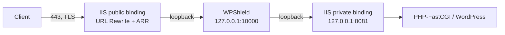

# ADR 0001 — How production traffic reaches WPShield

- **Status:** Proposed
- **Deciders:** WPShield maintainers
- **Affects:** M3 (rate limiting), M5 (dashboard), M6 (Windows Service), M7 (controlled activation)

## Context

WPShield inspects requests before they reach IIS, PHP or WordPress. Every milestone through M2
assumes a loopback laboratory, so the question of how a real request arrives has never been
answered. It cannot be deferred past M2, because the answer changes the design of TLS handling,
client-address resolution, rate limiting and the bypass procedure.

The constraint is simple and hard: **on a Windows Server host, IIS already owns ports 80 and 443.**
HTTP.SYS does not let two processes share a binding for the same host and port. Something has to
move, and the choice determines what WPShield must implement.

The project's own operating rule states that WPShield must not become a new point of failure and
must have a documented bypass and rollback procedure. That requirement, more than raw throughput,
drives this decision.

## Options

### Option A — IIS keeps the public ports and forwards to WPShield

IIS continues to terminate TLS on 80 and 443. A URL Rewrite rule forwards each request to the
WPShield gateway on loopback, and WPShield forwards it back to a private loopback binding of the same
IIS site. Requires Application Request Routing, which the current environment notes list as not
installed.



**For.** Bypass is a single rule toggle, which is the cheapest rollback of any option and directly
satisfies the project's operating rule. IIS keeps certificate management, so existing automated
renewal continues to work untouched. HTTP/2, TLS configuration, SNI and client certificates stay
where they already work. Nothing about the public surface changes, so the blast radius of a WPShield
failure is bounded by one rewrite rule. It is the only option that allows Monitor mode on a real site
without first solving certificate automation.

**Against.** Two extra loopback hops per request. Requires installing ARR, reversing an existing
decision. The rewrite rule must be prevented from re-matching the request WPShield sends back, or the
request loops until a limit is hit.

### Option B — WPShield owns the public ports

WPShield binds 80 and 443 and terminates TLS in Kestrel. IIS sites move to loopback-only bindings.

**For.** One hop. WPShield sees the true client connection, so client-address resolution needs no
trust assumptions at all. The architecture is conceptually clean and matches how most standalone web
application firewalls deploy.

**Against.** WPShield inherits certificate storage, SNI selection, renewal, TLS policy, HTTP/2 and
HTTP/3 negotiation, and client certificate handling. On Windows this means integrating with the
certificate store and with whatever renewal tooling the operator already uses. Bypass means changing
bindings, which is slow and error-prone under pressure. A defect in WPShield takes both sites offline
with no fast path back.

### Option C — Native or managed IIS module

WPShield runs inside the IIS pipeline as a module rather than as a proxy.

**For.** Best performance, no extra hop, full access to IIS request state.

**Against.** Highest implementation cost and the hardest failure mode, since a module defect can take
down the worker process. It would couple `WPShield.Core` to IIS and forfeit the platform independence
the project deliberately maintains. A module cannot be developed or tested without IIS, which raises
the barrier for community contributors.

## Decision

**Adopt Option A for M7 and keep Option B as a later evolution.** Option C is rejected for now.

The deciding factor is reversibility, not throughput. Option A is the only path where an operator can
place WPShield in front of a live WordPress site and remove it in seconds if something goes wrong,
which is exactly the posture a research-stage security gateway should have. The extra loopback hop is
an acceptable price during Monitor-first rollout; if measurement later shows it matters, Option B
becomes the optimization, informed by real traffic instead of speculation.

This reverses the environment note that records ARR as not installed. Installing ARR is now a
prerequisite for M7.

## Consequences

### The "never trust forwarding headers" invariant becomes conditional

This is the most important consequence and it must be designed before M3, because rate limiting is
worthless if WPShield cannot identify the client.

Today the gateway is the only hop, so every inbound forwarding header is untrusted without exception
and is stripped. Under Option A the real client address arrives in `X-Forwarded-For` from a local
proxy, and discarding it would make every request appear to come from `127.0.0.1`. Per-IP rate
limiting would then throttle all visitors as one, and logged evidence would be useless.

The invariant becomes: **trust forwarding headers only when the connection originates from a
configured trusted proxy, and never otherwise.**

```json
{
  "Gateway": {
    "TrustedProxies": ["127.0.0.1", "::1"]
  }
}
```

Required behavior:

- `TrustedProxies` defaults to **empty**, which preserves today's strip-everything behavior. An
  operator must opt in, so the safe posture survives an incomplete configuration.
- When the peer address is not in the list, strip every untrusted header exactly as now.
- When the peer address is in the list, resolve the client address from `X-Forwarded-For` and
  `X-Forwarded-Proto`, then replace the headers with the resolved values before forwarding.
- Continue to strip `X-Original-URL`, `X-Rewrite-URL` and the client-address family unconditionally.
  Those are never legitimate, from any peer.
- Bound the accepted `X-Forwarded-For` chain length so a client cannot exhaust parsing with a long
  header.

### Loop prevention must not rely on a header a client can forge

The rewrite rule must skip requests that WPShield has already inspected, otherwise the request that
WPShield sends back to IIS matches the rule again. The natural marker is the correlation header
WPShield stamps on every forwarded request.

This is only safe because WPShield strips a client-supplied `X-WPShield-Request-ID` before
forwarding. Without that guarantee, any visitor could add the header and skip inspection entirely.
The header stripping in `WPShieldTransformer` is therefore load-bearing for this design, not a
cosmetic hardening measure.

The configuration below is the proposed shape and **must be validated in the M1.3 laboratory before
any production use**:

```xml
<rule name="WPShield" stopProcessing="true">
  <match url=".*" />
  <conditions>
    <!-- Skip requests WPShield already inspected. A client cannot forge this header
         because the gateway strips any inbound value before forwarding. -->
    <add input="{HTTP_X_WPSHIELD_REQUEST_ID}" pattern="^$" />
  </conditions>
  <action type="Rewrite" url="http://127.0.0.1:10000/{R:0}" />
</rule>
```

ARR must be configured to preserve the client `Host` header, because WPShield resolves the site from
it and fails closed with HTTP 421 when it does not match. The operator also needs `X-Forwarded-Proto`
populated so WordPress continues to generate `https` URLs; verify whether ARR sets it or whether a
server variable must be added.

### Other consequences

- **Gateway listeners.** `GatewayConfigurationValidator` enforces loopback-only listeners. Option A
  keeps that restriction permanently, which is a benefit: the gateway never needs a public binding.
- **Destination validation.** The validator rejects non-loopback destinations. Option A keeps
  destinations on loopback too, so no relaxation is needed for M7.
- **Loop detection.** The current check compares listener and destination ports only. Under Option A
  the gateway forwards to a different port on the same host, so the check still holds, but it should
  be tightened to compare host and port together.
- **Health endpoints.** They remain loopback-only and are never exposed through the rewrite rule.
- **M6 packaging.** The Windows Service needs no elevated port binding rights, since it only listens
  on a high loopback port. This meaningfully lowers the privilege requirement.
- **Performance.** Two extra loopback hops per request. Measure during M7 phase 3 on a test site
  before enabling a real one.

## Validation before M7

- Confirm the rewrite rule cannot loop, including for requests that already carry the correlation
  header from an earlier attempt.
- Confirm the `Host` header survives the ARR hop for every configured site.
- Confirm `X-Forwarded-Proto` reaches WordPress so canonical URLs, redirects and the login flow keep
  using `https`.
- Confirm the real client address appears in evidence rather than `127.0.0.1`.
- Confirm Elementor and Google Site Kit continue to work across the extra hop.
- Confirm WebSocket and long-polling upgrades survive both hops.
- Time the bypass procedure. Disabling the rule must restore direct service in seconds.
- Confirm that stopping the WPShield service produces a clear failure and a documented recovery,
  rather than a silent outage.

## Revisiting this decision

Move to Option B when all of the following hold: Monitor mode has run stably on real traffic for a
sustained period, measurement shows the extra hop is a real cost rather than a theoretical one, and
certificate automation on Windows has been solved and tested including renewal. Until then the
reversibility of Option A is worth more than the latency it costs.
