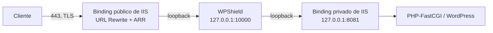

# ADR 0001 — Cómo llega el tráfico de producción a WPShield

- **Estado:** Propuesto
- **Responsables:** mantenedores de WPShield
- **Afecta a:** M3 (rate limiting), M5 (dashboard), M6 (servicio de Windows), M7 (activación controlada)

## Contexto

WPShield inspecciona solicitudes antes de que lleguen a IIS, PHP o WordPress. Todos los hitos hasta
M2 asumen un laboratorio en loopback, así que la pregunta de cómo llega una solicitud real nunca se
respondió. No puede posponerse más allá de M2, porque la respuesta cambia el diseño del manejo de
TLS, la resolución de la dirección del cliente, el rate limiting y el procedimiento de bypass.

La restricción es simple y dura: **en un host con Windows Server, IIS ya es dueño de los puertos 80 y
443.** HTTP.SYS no permite que dos procesos compartan un binding para el mismo host y puerto. Algo
tiene que moverse, y la elección determina qué debe implementar WPShield.

La regla operativa del propio proyecto establece que WPShield no debe convertirse en un nuevo punto
de falla y debe tener un procedimiento documentado de bypass y rollback. Ese requisito, más que el
rendimiento bruto, es lo que guía esta decisión.

## Opciones

### Opción A — IIS conserva los puertos públicos y reenvía a WPShield

IIS sigue terminando TLS en 80 y 443. Una regla de URL Rewrite reenvía cada solicitud al gateway de
WPShield en loopback, y WPShield la devuelve a un binding privado de loopback del mismo sitio IIS.
Requiere Application Request Routing, que las notas del entorno actual registran como no instalado.



**A favor.** El bypass es un solo interruptor de regla, el rollback más barato de todas las opciones y
lo que satisface directamente la regla operativa del proyecto. IIS conserva la gestión de
certificados, así que la renovación automática existente sigue funcionando intacta. HTTP/2, la
configuración TLS, SNI y los certificados de cliente permanecen donde ya funcionan. Nada de la
superficie pública cambia, de modo que el radio de impacto de una falla de WPShield queda acotado a
una regla de reescritura. Es la única opción que permite modo Monitor en un sitio real sin resolver
antes la automatización de certificados.

**En contra.** Dos saltos de loopback adicionales por solicitud. Exige instalar ARR, revirtiendo una
decisión previa. Hay que impedir que la regla de reescritura vuelva a coincidir con la solicitud que
WPShield devuelve, o la solicitud entra en bucle hasta agotar un límite.

### Opción B — WPShield es dueño de los puertos públicos

WPShield escucha en 80 y 443 y termina TLS en Kestrel. Los sitios IIS pasan a bindings solo de
loopback.

**A favor.** Un solo salto. WPShield ve la conexión real del cliente, así que la resolución de la
dirección no necesita ninguna suposición de confianza. La arquitectura es conceptualmente limpia y
coincide con el despliegue típico de un firewall de aplicaciones web independiente.

**En contra.** WPShield hereda el almacenamiento de certificados, la selección por SNI, la renovación,
la política TLS, la negociación de HTTP/2 y HTTP/3 y el manejo de certificados de cliente. En Windows
eso implica integrarse con el almacén de certificados y con la herramienta de renovación que el
operador ya use. El bypass exige cambiar bindings, algo lento y propenso a errores bajo presión. Un
defecto en WPShield deja ambos sitios fuera de línea sin una vía rápida de retorno.

### Opción C — Módulo nativo o administrado de IIS

WPShield corre dentro del pipeline de IIS como módulo en lugar de como proxy.

**A favor.** El mejor rendimiento, sin saltos adicionales, acceso completo al estado de la solicitud.

**En contra.** El costo de implementación más alto y el modo de falla más duro, ya que un defecto del
módulo puede tumbar el proceso de trabajo. Acoplaría `WPShield.Core` a IIS y renunciaría a la
independencia de plataforma que el proyecto mantiene deliberadamente. Un módulo no puede
desarrollarse ni probarse sin IIS, lo que eleva la barrera para la comunidad.

## Decisión

**Adoptar la Opción A para M7 y dejar la Opción B como evolución posterior.** La Opción C se rechaza
por ahora.

El factor decisivo es la reversibilidad, no el rendimiento. La Opción A es el único camino en el que
un operador puede poner WPShield delante de un sitio WordPress en vivo y retirarlo en segundos si
algo sale mal, que es exactamente la postura que debe tener un gateway de seguridad en etapa de
investigación. El salto adicional de loopback es un precio aceptable durante un despliegue
Monitor-first; si la medición demuestra después que importa, la Opción B pasa a ser la optimización,
informada por tráfico real en vez de por especulación.

Esto revierte la nota del entorno que registra ARR como no instalado. Instalar ARR pasa a ser un
prerrequisito de M7.

## Consecuencias

### El invariante «nunca confiar en encabezados de reenvío» pasa a ser condicional

Es la consecuencia más importante y debe diseñarse antes de M3, porque el rate limiting no sirve de
nada si WPShield no puede identificar al cliente.

Hoy el gateway es el único salto, así que todo encabezado de reenvío entrante es no confiable sin
excepción y se elimina. Bajo la Opción A la dirección real del cliente llega en `X-Forwarded-For`
desde un proxy local, y descartarla haría que toda solicitud pareciera venir de `127.0.0.1`. El rate
limiting por IP estrangularía entonces a todos los visitantes como si fueran uno, y la evidencia
registrada sería inútil.

El invariante pasa a ser: **confiar en los encabezados de reenvío solo cuando la conexión se origina
en un proxy confiable configurado, y nunca en otro caso.**

```json
{
  "Gateway": {
    "TrustedProxies": ["127.0.0.1", "::1"]
  }
}
```

Comportamiento requerido:

- `TrustedProxies` vale **vacío** por defecto, lo que preserva el comportamiento actual de eliminar
  todo. El operador debe optar explícitamente, de modo que la postura segura sobreviva a una
  configuración incompleta.
- Cuando la dirección del par no está en la lista, eliminar todos los encabezados no confiables
  exactamente como ahora.
- Cuando la dirección del par sí está en la lista, resolver la dirección del cliente desde
  `X-Forwarded-For` y `X-Forwarded-Proto`, y luego reemplazar los encabezados con los valores
  resueltos antes de reenviar.
- Seguir eliminando `X-Original-URL`, `X-Rewrite-URL` y la familia de direcciones de cliente sin
  condiciones. Nunca son legítimos, venga de donde venga la solicitud.
- Acotar la longitud aceptada de la cadena `X-Forwarded-For` para que un cliente no pueda agotar el
  análisis con un encabezado larguísimo.

### La prevención de bucles no puede depender de un encabezado que el cliente pueda falsificar

La regla de reescritura debe omitir las solicitudes que WPShield ya inspeccionó; de lo contrario, la
solicitud que WPShield devuelve a IIS vuelve a coincidir con la regla. El marcador natural es el
encabezado de correlación que WPShield estampa en cada solicitud reenviada.

Esto solo es seguro porque WPShield elimina cualquier `X-WPShield-Request-ID` suministrado por el
cliente antes de reenviar. Sin esa garantía, cualquier visitante podría añadir el encabezado y
saltarse la inspección por completo. La eliminación de encabezados en `WPShieldTransformer` es, por
tanto, estructural para este diseño y no una medida cosmética.

La configuración siguiente es la forma propuesta y **debe validarse en el laboratorio M1.3 antes de
cualquier uso en producción**:

```xml
<rule name="WPShield" stopProcessing="true">
  <match url=".*" />
  <conditions>
    <!-- Omite las solicitudes que WPShield ya inspeccionó. Un cliente no puede falsificar
         este encabezado porque el gateway elimina cualquier valor entrante antes de reenviar. -->
    <add input="{HTTP_X_WPSHIELD_REQUEST_ID}" pattern="^$" />
  </conditions>
  <action type="Rewrite" url="http://127.0.0.1:10000/{R:0}" />
</rule>
```

ARR debe configurarse para preservar el encabezado `Host` del cliente, porque WPShield resuelve el
sitio a partir de él y falla cerrado con HTTP 421 cuando no coincide. El operador también necesita que
`X-Forwarded-Proto` llegue poblado para que WordPress siga generando URLs `https`; verifique si ARR lo
establece o si hace falta añadir una variable de servidor.

### Otras consecuencias

- **Listeners del gateway.** `GatewayConfigurationValidator` obliga a escuchar solo en loopback. La
  Opción A mantiene esa restricción de forma permanente, lo cual es una ventaja: el gateway nunca
  necesita un binding público.
- **Validación de destinos.** El validador rechaza destinos que no sean loopback. La Opción A también
  mantiene los destinos en loopback, así que no hace falta relajar nada para M7.
- **Detección de bucles.** La comprobación actual compara solamente los puertos de listener y destino.
  Bajo la Opción A el gateway reenvía a un puerto distinto del mismo host, así que la comprobación
  sigue siendo válida, pero conviene endurecerla para comparar host y puerto juntos.
- **Endpoints de salud.** Permanecen solo en loopback y nunca se exponen a través de la regla.
- **Empaquetado de M6.** El servicio de Windows no necesita derechos para enlazar puertos
  privilegiados, ya que solo escucha en un puerto alto de loopback. Eso reduce de forma significativa
  el requisito de privilegios.
- **Rendimiento.** Dos saltos de loopback adicionales por solicitud. Medir durante la fase 3 de M7 en
  un sitio de prueba antes de habilitar uno real.

## Validación previa a M7

- Confirmar que la regla de reescritura no puede entrar en bucle, incluso para solicitudes que ya
  traigan el encabezado de correlación de un intento anterior.
- Confirmar que el encabezado `Host` sobrevive al salto por ARR para cada sitio configurado.
- Confirmar que `X-Forwarded-Proto` llega a WordPress para que las URLs canónicas, las redirecciones y
  el flujo de inicio de sesión sigan usando `https`.
- Confirmar que la dirección real del cliente aparece en la evidencia y no `127.0.0.1`.
- Confirmar que Elementor y Google Site Kit siguen funcionando a través del salto adicional.
- Confirmar que las actualizaciones a WebSocket y el long-polling sobreviven a ambos saltos.
- Cronometrar el procedimiento de bypass. Deshabilitar la regla debe restaurar el servicio directo en
  segundos.
- Confirmar que detener el servicio de WPShield produce una falla clara y una recuperación
  documentada, en lugar de una caída silenciosa.

## Cuándo revisar esta decisión

Pasar a la Opción B cuando se cumplan todas estas condiciones: el modo Monitor ha funcionado de forma
estable con tráfico real durante un período sostenido, la medición demuestra que el salto adicional es
un costo real y no teórico, y la automatización de certificados en Windows está resuelta y probada,
incluida la renovación. Hasta entonces, la reversibilidad de la Opción A vale más que la latencia que
cuesta.
