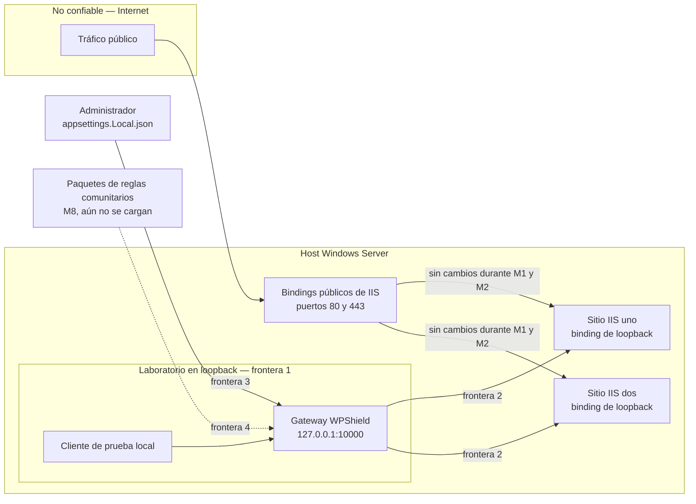

# Modelo de amenazas

Este documento indica qué defiende WPShield, contra quién, con qué control y —lo que más importa en
un proyecto en etapa de investigación— qué **no** defiende todavía. Cada identificador de regla,
puntuación, umbral y límite que aparece abajo es un valor del árbol de fuentes, no una aspiración. Si
una afirmación de aquí deja de coincidir con `src/`, la afirmación es el defecto.

La versión en inglés es [`THREAT_MODEL.md`](../../THREAT_MODEL.md). Ambas cambian en el mismo pull
request; que difieran es un defecto, no una diferencia de estilo.

> [!IMPORTANT]
> WPShield es una vista previa de investigación temprana. Durante M1 y M2 el gateway escucha
> únicamente en loopback y no está en la ruta de ninguna solicitud real. Nada en este documento debe
> leerse como que un sitio en producción está protegido hoy.

## Alcance

**Dentro del alcance.** La solicitud HTTP tal como llega, antes de alcanzar IIS, PHP o WordPress: el
nombre de host que declara, los metadatos de reenvío que transporta, su tamaño y —desde M2— los
nombres de archivo y una muestra limitada de datos dentro de una carga multipart.

**Fuera del alcance, a propósito.** WPShield **no** es un antivirus, **no** es un EDR, **no** es un
escáner de malware sobre archivos almacenados, **no** reemplaza a Microsoft Defender, **no** es una
solución de actualización de WordPress y **no** es mitigación volumétrica de DDoS. Nunca analiza,
pone en cuarentena ni elimina un archivo en disco, y no tiene visibilidad de un host que ya fue
comprometido. La seguridad del núcleo de WordPress, de los plugins y temas de terceros, de PHP y del
propio IIS pertenece a sus fabricantes; vea [SECURITY.md](../../SECURITY.md) y
[NOTICE.md](../../NOTICE.md).

Una capa de protección que promete más de lo que hace es peor que ninguna, porque el operador deja de
buscar en otra parte.

## Activos

| Activo | Por qué vale la pena atacarlo |
| --- | --- |
| Archivos de la aplicación WordPress y los directorios de carga | Un solo archivo escribible que el servidor web ejecutará convierte un fallo de escritura de archivos en ejecución remota de código. `wp-content/uploads` es escribible por diseño. |
| Disponibilidad de los sitios alojados en IIS | Son sitios de negocio en vivo. Una caída provocada por la capa de protección es un fallo de seguridad, no un compromiso aceptable. |
| Sesiones administrativas y secretos de la solicitud | Cookies, nonces, tokens, encabezados de autorización y cadenas de consulta completas. Divulgarlos anula todos los demás controles. |
| Integridad de la configuración y de las reglas de WPShield | La configuración decide qué host llega a qué backend y si un sitio bloquea. Una configuración silenciosamente equivocada es indistinguible de no tener protección. |
| Aislamiento entre sitios | Dos sitios WordPress en un mismo host Windows no deben convertirse en un solo radio de impacto porque un proxy enrutó una solicitud por conjetura. |

## Actores

| Actor | Capacidad que se asume | Qué busca |
| --- | --- | --- |
| **Cargador malicioso** | Puede alcanzar un endpoint de carga —un plugin vulnerable, una cuenta de suscriptor comprometida, un manejador de medios sin autenticación— y controla por completo el nombre de archivo, el tipo de contenido declarado y el cuerpo. | Un archivo que el servidor ejecute. |
| **Escáner automatizado** | Sin credenciales. Alto volumen de solicitudes contra `wp-login.php`, `xmlrpc.php`, `admin-ajax.php` y rutas de plugins conocidos. | Credenciales, un plugin sin parchear, una superficie enumerable. |
| **Atacante del encabezado `Host`** | Controla todos los encabezados de la solicitud, incluido `Host`, y puede dirigirse al gateway directamente. | Llegar a un sitio que el operador no asignó a ese nombre de host, o ser enrutado a un backend predeterminado que no debería existir. |
| **Cliente que suplanta encabezados** | Controla `X-Forwarded-*`, `Forwarded`, `X-Real-IP`, `X-Original-URL` y el resto de la familia de reenvío. | Que se le trate como una dirección de confianza, o hacer que IIS URL Rewrite resuelva una ruta distinta de la que fue inspeccionada. |
| **Operador que se equivoca al configurar** | Control administrativo total, intención legítima, poco tiempo. Es quien con más probabilidad edita configuración bajo presión durante un incidente. | Nada. Este actor está en el modelo porque la forma más probable de que WPShield falle es que se le haya configurado para hacer algo que su operador no pretendía. |
| **Autor de un paquete de reglas (M8)** | Entrega código que el motor de inspección carga y ejecuta en la ruta de la solicitud. | En el caso honesto, mejor detección. En el deshonesto, todo. |

## Fronteras de confianza

Hoy, durante M1 y M2, el gateway es un componente de laboratorio. El tráfico público nunca lo toca.

1. **Del cliente al gateway.** Todo lo que trae la solicitud está bajo control del atacante: método,
   ruta, `Host`, cada encabezado, el cuerpo y cada nombre de archivo que contiene. Nada de lo que
   llega aquí es de confianza, sin excepción, mientras el gateway sea el único salto.
2. **Del gateway al destino IIS en loopback.** El destino se valida al arranque: debe ser un URI
   `http`/`https` absoluto de loopback que no apunte a un puerto de escucha de WPShield. Aquí el
   gateway reescribe los encabezados de reenvío; lo que cruza esta frontera es lo que WPShield derivó
   de la conexión, no lo que envió el cliente.
3. **Del administrador a la configuración.** `appsettings.json` distribuye únicamente marcadores de
   documentación. Los nombres de host y destinos reales viven en `appsettings.Local.json`, ignorado
   por git y nunca copiado a un artefacto publicado. Quien pueda escribir ese archivo decide adónde
   va el tráfico.
4. **De los paquetes de reglas comunitarios al motor de inspección.** Aún no se cruza: no existe
   carga externa de reglas. Definirla es M8, y la frontera se nombra aquí para que se diseñe en lugar
   de descubrirse.

Bajo la ruta de tráfico decidida en
[ADR 0001](adr/0001-ruta-de-trafico-en-produccion.md), M7 agrega una quinta frontera: IIS conserva
los puertos 80 y 443 y reenvía al gateway de loopback mediante URL Rewrite y ARR. Eso inserta un
*proxy local* delante de WPShield y cambia la frontera 1 — vea
[T8](#t8--suplantación-de-encabezados-de-reenvío-y-de-sobrescritura-de-ruta).

## Cómo una detección se convierte en una acción

Las reglas no bloquean. Reportan una detección con puntuación, e `InspectionEngine` suma las
puntuaciones, limita el total a 100 y lo compara con los umbrales del sitio.

| Opción | Valor predeterminado | Origen |
| --- | --- | --- |
| `Mode` | `Monitor` | `SiteOptions.Mode` |
| `ObserveThreshold` | 30 | `SiteOptions.ObserveThreshold` |
| `BlockThreshold` | 80 | `SiteOptions.BlockThreshold` |

Una puntuación igual o superior a `BlockThreshold` produce `Block` **solo** cuando el sitio está
explícitamente en modo `Block`; en `Monitor` produce `Observe`. Una puntuación igual o superior a
`ObserveThreshold` produce `Observe`. Cualquier otra cosa es `Allow`, y un sitio `Disabled` devuelve
`Allow` con puntuación cero sin evaluar ninguna regla.

Por eso las puntuaciones individuales están calibradas como están: una señal débil no debe bloquear
por sí sola y una combinación sí debe hacerlo. `..\..\photo.php.jpg.` produce cuatro detecciones
—WP-UPLOAD-001 con 50 (extensión incrustada, no final), WP-UPLOAD-002 con 30, FILE-NAME-001 con 60 y
PHP-CONTENT-001 con 75— que suman más allá del límite y quedan en 100. En el modo `Monitor`
predeterminado la acción recomendada es `Observe`, que es lo que hoy reportan tanto
`WPShield.Service` como el gateway para ese nombre.

## Amenazas

| # | Amenaza | Control actual | Estado |
| --- | --- | --- | --- |
| [T1](#t1--subida-de-un-archivo-que-un-manejador-php-ejecutará) | Subida de un archivo que un manejador PHP ejecutará | `WP-UPLOAD-001` | Entregada y en ejecución sobre tráfico multipart |
| [T2](#t2--subida-de-un-archivo-que-ejecutará-el-propio-iis) | Subida de un archivo que ejecutará el propio IIS | `IIS-UPLOAD-001` | Entregada y en ejecución sobre tráfico multipart |
| [T3](#t3--subida-de-webconfig-como-ejecución-remota-de-código) | Subida de `web.config` como ejecución remota de código | `IIS-CONFIG-001` | Entregada y en ejecución sobre tráfico multipart |
| [T4](#t4--extensión-disfrazada) | Extensión disfrazada (`photo.php.jpg`) | `WP-UPLOAD-002` | Entregada y en ejecución sobre tráfico multipart |
| [T5](#t5--normalización-de-escritura-de-windows) | Normalización de escritura de Windows (`shell.php.`, `shell.php `, `shell.php::$DATA`) | `NormalizedFileName` + `FILE-NAME-001` | Entregado |
| [T6](#t6--contenido-ejecutable-bajo-un-nombre-inofensivo) | Contenido ejecutable bajo un nombre inofensivo, y tipo declarado que no corresponde | `PHP-CONTENT-001`, `FILE-TYPE-001`, `PHP-CONTENT-002` | Parcial — limitada a la muestra y solo multipart |
| [T7](#t7--confusión-del-encabezado-host-en-un-despliegue-multisitio) | Confusión del encabezado `Host` en un despliegue multisitio | Mapa explícito de hosts, HTTP 421 | Entregado |
| [T8](#t8--suplantación-de-encabezados-de-reenvío-y-de-sobrescritura-de-ruta) | Suplantación de encabezados de reenvío y de sobrescritura de ruta | Barrido de encabezados en `WPShieldTransformer` | Entregado |
| [T9](#t9--cuerpos-de-solicitud-sin-límite-o-de-tamaño-excesivo) | Cuerpos de solicitud sin límite o de tamaño excesivo | 6 MiB predeterminado, techo de 64 MiB, HTTP 413, estructura multipart acotada | Parcial — la concurrencia no está acotada, M3 |
| [T10](#t10--sondeo-automatizado-y-solicitudes-abusivas-repetidas) | Sondeo automatizado y solicitudes abusivas repetidas | Ninguno | **Sin mitigar — M3** |
| [T11](#t11--divulgación-de-secretos-a-través-de-registros-y-evidencia) | Divulgación de secretos a través de registros y evidencia | Disciplina de registro sostenida en la revisión de código | Parcial — las pruebas automatizadas son M4 |
| [T12](#t12--el-gateway-como-nueva-superficie-de-ataque-y-punto-único-de-fallo) | El gateway como nueva superficie de ataque y punto único de fallo | Validación de arranque que falla cerrado, solo loopback, bypass por conmutador de regla | Parcial — M7 |
| [T13](#t13--cadena-de-suministro-dependencias-y-paquetes-de-reglas-comunitarios) | Cadena de suministro: dependencias y paquetes de reglas comunitarios | Versiones fijadas, CodeQL, acciones fijadas por SHA | Parcial — los paquetes de reglas son M8 |

---

### T1 — Subida de un archivo que un manejador PHP ejecutará

**El ataque.** Un endpoint de carga vulnerable o demasiado permisivo acepta `shell.php` dentro de
`wp-content/uploads`. Solicitarlo de vuelta lo ejecuta.

**Por qué Windows e IIS son distintos.** El vocabulario de extensiones es más amplio que el que
enumera una guía escrita para Linux, porque las asignaciones de manejador de IIS para PHP-FastCGI
suelen registrarse con comodín en lugar de sobre el conjunto exacto documentado. Por eso
`WP-UPLOAD-001` cubre `php`, `php3`, `php4`, `php5`, `php7`, `php8`, `phps`, `pht`, `phtm`, `phtml` y
`phar`.

**Control.** `WP-UPLOAD-001` — 90 cuando la extensión ejecutable es la final, 50 cuando está
incrustada. La comparación recorre **todos** los segmentos de extensión del nombre normalizado, no
solo el último.

**Sin mitigar.** Desde M2 la regla se ejecuta sobre el tráfico del gateway, así que lo que queda es
el alcance de la propia regla y no una brecha de conexión. Solo se inspeccionan cuerpos
`multipart/form-data`, de modo que el mismo archivo enviado en una solicitud JSON, urlencoded o
`application/octet-stream` pasa intacto. Una extensión que este vocabulario no liste, o una
asignación de manejador que el propio operador haya agregado, no se detecta. Un archivo llamado `shell.php` en un sitio sin ninguna asignación de manejador PHP es un
falso positivo por diseño: la regla reporta el nombre, no la configuración del servidor.

### T2 — Subida de un archivo que ejecutará el propio IIS

**El ataque.** Un archivo `.aspx` o `.ashx` depositado en un directorio de cargas escribible se
ejecuta con la identidad del grupo de aplicaciones.

**Por qué Windows e IIS son distintos.** Esta es la brecha que WPShield existe para cerrar. Una capa
de protección escrita para alojamiento Linux no tiene motivo para considerar peligroso un `.aspx`, y
un manejador ASP.NET ejecutándose con la identidad del grupo de aplicaciones es una capacidad
estrictamente mayor que un shell PHP bajo FastCGI.

**Control.** `IIS-UPLOAD-001` — 90 final, 50 incrustada, sobre `aspx`, `asp`, `ashx`, `asmx`, `ascx`,
`axd`, `cshtml`, `vbhtml`, `razor`, `svc`, `soap`, `rem`, `asax` y `master`.

**Sin mitigar.** El mismo límite de alcance que en T1: solo se inspecciona `multipart/form-data`. Un
sitio que distribuya legítimamente
archivos de ese tipo como descargas producirá detecciones; la recomendación es permanecer en
`Monitor` y registrarlas, no quitar la regla.

### T3 — Subida de `web.config` como ejecución remota de código

**El ataque.** Escribir un `web.config` en un directorio servido. IIS lo lee y lo aplica a ese
directorio y a sus hijos. El atacante puede registrar una asignación de manejador que ejecute los
archivos que elija, volver a habilitar la ejecución de scripts que el operador deshabilitó o relajar
la autorización, convirtiendo una escritura arbitraria de archivos en ejecución remota de código
**sin subir ningún script**.

**Por qué Windows e IIS son distintos.** No hay equivalente en Linux tan directo. `.htaccess` es el
análogo más cercano y suele estar deshabilitado; `web.config` se lee de forma predeterminada en todo
lugar donde IIS sirve.

**Control.** `IIS-CONFIG-001`, puntuación **100** — la regla de mayor confianza que WPShield entrega
y, por sí sola, por encima del umbral de bloqueo predeterminado. Compara el nombre reservado exacto
después de la normalización, de modo que `web.config.`, `WEB.CONFIG`, `web.config::$DATA` y
`../web.config` se reconocen todos. Deliberadamente no coincide con cualquier extensión `.config`,
así que un sitio que distribuye un archivo de configuración no relacionado no se ve afectado.

**Sin mitigar.** Solo se inspecciona `multipart/form-data`, así que un `web.config` escrito por un
PUT `application/octet-stream` crudo no se ve, y tampoco uno que viaje dentro de un archivo
comprimido de plugin o tema, porque el contenido de los archivos comprimidos nunca se abre. WPShield
ve una carga en tránsito; no puede ver un
`web.config` que llegó por FTP, por una canalización de despliegue comprometida o antes de que
WPShield existiera. Detectar eso es monitoreo de integridad de archivos, que está fuera del alcance.

### T4 — Extensión disfrazada

**El ataque.** `photo.php.jpg` se presenta como una imagen ante cualquier comprobación que lea
únicamente la última extensión, y sigue siendo ejecutable bajo una instalación PHP-FastCGI con
`cgi.fix_pathinfo` habilitado o con una asignación de manejador de IIS que coincida por comodín.

**Control.** `WP-UPLOAD-002`, puntuación **30**, deliberadamente baja. Es una señal de disfraz, no
prueba de ejecución, y solo alcanza el umbral de bloqueo en combinación con `WP-UPLOAD-001` o
`IIS-UPLOAD-001` reportando el mismo nombre. Esa combinación es justamente el punto: las reglas suman
señales en lugar de bloquear por una sola señal débil.

**Sin mitigar.** Un `readme.php.txt` genuinamente benigno es estructuralmente idéntico a una carga
disfrazada y no puede separarse de ella solo por el nombre. Los nombres ordinarios con varias
extensiones como `archive.tar.gz`, `style.min.css` y `report.2024.xlsx` nunca coinciden, porque la
regla exige un segmento *ejecutable* y no simplemente más de un segmento.

### T5 — Normalización de escritura de Windows

**El ataque.** Enviar un nombre que la inspección lee como inofensivo y que Windows escribe en disco
como otra cosa:

| Enviado | Llega al disco como | Mecanismo |
| --- | --- | --- |
| `shell.php.` | `shell.php` | Windows elimina los puntos finales |
| `shell.php ` | `shell.php` | Windows elimina los espacios finales |
| `shell.php::$DATA` | `shell.php` | Sufijo de flujo de datos alternativo de NTFS |
| `..\..\shell.php` | `shell.php`, en otra ubicación | Salto de directorio; solo el segmento final es un nombre |
| `shell.p<NUL>hp` | varía | Los consumidores posteriores descartan los caracteres de control |

**Por qué Windows e IIS son distintos.** Esta es toda la razón por la que existe
`NormalizedFileName`. Cada fila de arriba es un comportamiento de Windows/NTFS sin contraparte en
Linux, y cada una derrota una comprobación ingenua que compare la cadena enviada contra una lista de
denegación.

**Control.** Dos capas. Primera: **las reglas nunca comparan contra el nombre crudo del cliente**;
comparan contra `InspectionContext.NormalizedFile`, que aproxima lo que Windows realmente colocaría
en disco. Segunda: `FILE-NAME-001` reporta las anomalías que la normalización tuvo que eliminar:
`pathSeparator`, `alternateDataStream`, `trailingDotsOrSpaces`, `controlCharacter`,
`reservedDeviceName` (`CON`, `PRN`, `AUX`, `NUL`, `COM1`–`COM9`, `LPT1`–`LPT9`), `excessiveLength`
(más de 255 unidades UTF-16) y `emptyAfterNormalization`. Su puntuación es **60**, a propósito por
debajo del umbral de bloqueo, porque algunos navegadores y clientes heredados envían una ruta local
completa y de otro modo quedarían bloqueados. Combinada con una detección de extensión ejecutable
supera el umbral, que es el resultado buscado para `../../shell.php.`.

**Sin mitigar.** Confiar en que WordPress llame a `sanitize_file_name()` no es un control: los
endpoints de plugins vulnerables que causan incidentes de carga son exactamente los que escriben
archivos sin llamarla. La evidencia registra los tipos de anomalía y el resultado normalizado, nunca
el nombre crudo, de modo que no se puede atacar a un consumidor de registros a través de la
evidencia; pero eso también significa que el nombre crudo no queda disponible para el análisis
forense.

### T6 — Contenido ejecutable bajo un nombre inofensivo

**El ataque.** El nombre no llama la atención; los bytes sí. Una imagen políglota con un prólogo PHP,
o un archivo cuyo `Content-Type` declarado contradice tanto su nombre como su contenido.

**Control.** Tres reglas, todas leyendo `InspectionContext.Sample`, que el lector multipart rellena
ahora con los primeros `Gateway:Multipart:SampleBytes` —4096 de forma predeterminada— de cada parte
de archivo. `PHP-CONTENT-001`, puntuación **75**, busca `<?php` o `<?=` en cualquier lugar de esa
muestra. `FILE-TYPE-001` compara la extensión final con los bytes iniciales y puntuúa **70** para
texto de script, **70** para una cabecera `MZ` o ELF y **40** para texto plano donde se declaró un
formato binario; ninguna de las tres bloquea por sí sola. `PHP-CONTENT-002`, puntuación **85**,
bloquea sola pero se dispara únicamente ante una prueba estructural: una firma del conjunto de
`getimagesize()` en el desplazamiento 0 más un marcador PHP validado que un recorrido acotado
demuestra que está después del tráiler GIF, después de `IEND` de PNG, después de `EOI` de JPEG o
más allá de la longitud declarada de un BMP o un RIFF.

**Sin mitigar, y la mitad de esta amenaza referida al tipo declarado queda deliberadamente fuera.**
`FILE-TYPE-001` nunca se dispara por el `Content-Type` declarado; este se registra únicamente como un
token de cuatro estados —agrees, disagrees, opaque, absent— y jamás como un hallazgo. Los
navegadores derivan el `Content-Type` de una parte de esa misma extensión, y curl, wp-cli, las
aplicaciones móviles y el respaldo de plupload envían legítimamente `application/octet-stream`, de
modo que una regla que se disparase por esa discrepancia se dispararía con todo cliente que no sea un
navegador. La comparación por contenido también sigue limitada a una muestra por diseño —WPShield
nunca retiene una carga completa para inspeccionarla—, así que un marcador colocado más allá de la
ventana de muestra no se ve, y `PHP-CONTENT-002` solo demuestra el políglota de portador mínimo,
porque en una fotografía real el `EOI` del JPEG queda muy por detrás de esa ventana. El contenido de
los archivos comprimidos nunca se abre. `FILE-TYPE-001` también guarda silencio ante bytes que no
reconoce, que es lo que la mantiene callada frente a los fragmentos de plupload con los que
forzosamente llega toda carga mayor que el límite de solicitud. Las reglas basadas en el nombre, no
las de contenido, siguen siendo la detección que sostiene el peso.

### T7 — Confusión del encabezado `Host` en un despliegue multisitio

**El ataque.** Enviar `Host: wordpress-two.example` a un proxy que está delante de
`wordpress-one.example` y ver qué backend responde. Cualquier proxy con un backend predeterminado o
de respaldo filtra un sitio dentro del radio de impacto del otro.

**Control.** **No existe backend predeterminado.** `SiteResolver` construye un mapa explícito, sin
distinguir mayúsculas, de nombre de host a sitio; un nombre de host asignado dos veces es un fallo de
arranque, y un nombre de host vacío es un fallo de arranque. La comparación normaliza el punto final
de un nombre absoluto, elimina el puerto y maneja literales IPv6 entre corchetes, de modo que
`WordPress-One.Example:10000` y `wordpress-one.example.` resuelven al mismo sitio y nada más lo hace.
Un host que no resuelve se rechaza con **HTTP 421 `unknown_host`** antes de contactar backend alguno,
y el rechazo se registra con el identificador de solicitud, el host, el método y la ruta — nunca la
cadena de consulta.

**Sin mitigar.** Bajo la ruta de M7, ARR debe preservar el encabezado `Host` del cliente o cada
solicitud se convierte en un 421. El ADR 0001 lo lista como elemento de validación; es una dependencia
de correctitud sobre un componente ajeno a WPShield.

### T8 — Suplantación de encabezados de reenvío y de sobrescritura de ruta

**El ataque.** Dos resultados distintos a partir de la misma clase de encabezado. Enviar
`X-Forwarded-For: 127.0.0.1` hace que un plugin, una herramienta de seguridad o un limitador de tasa
crean que la solicitud es local. Enviar `X-Original-URL: /wp-admin/` hace que IIS URL Rewrite trate
esa como la ruta efectiva — un vector conocido de omisión de autenticación, porque la solicitud que
se autoriza no es la solicitud que se inspeccionó.

**Por qué Windows e IIS son distintos.** `X-Original-URL` y `X-Rewrite-URL` son significativos
precisamente porque IIS URL Rewrite los honra. En una pila Linux suelen ser inertes.

**Control.** `WPShieldTransformer` elimina todo el conjunto de reenvío no confiable antes de agregar
los valores propios de WPShield, de modo que el barrido nunca puede eliminar lo que acaba de
producir. Se eliminan: `Forwarded`; todas las variantes `X-Forwarded-*`, comparadas **por prefijo**
para cubrir también encabezados que este proyecto no ha visto nunca; la familia de direcciones de
cliente `X-Real-IP`, `X-Client-IP`, `X-Cluster-Client-IP`, `True-Client-IP`, `CF-Connecting-IP`,
`Fastly-Client-IP`, `X-Azure-ClientIP`, `X-Azure-SocketIP`; los encabezados de sobrescritura de ruta
`X-Original-URL`, `X-Rewrite-URL`, `X-Original-Host`; y el propio `X-WPShield-Request-ID` de
WPShield. Solo entonces establece `X-Forwarded-For` a partir de la conexión real,
`X-Forwarded-Proto`, `X-Forwarded-Host` y un identificador de solicitud nuevo.

Eliminar el `X-WPShield-Request-ID` entrante **sostiene peso, no es cosmético**: la regla de reescritura
contra bucles del ADR 0001 omite las solicitudes que ya lo traen. Si un cliente pudiera establecerlo,
un cliente podría saltarse la inspección por completo.

**Sin mitigar, y cambia en M7.** Hoy el gateway es el único salto, así que descartarlo todo es
correcto. Bajo el ADR 0001 la dirección real del cliente llega en `X-Forwarded-For` desde un proxy
local, y descartarla haría que todos los visitantes parecieran `127.0.0.1` — lo que haría que el
límite de tasa por IP de T10 estrangulara a todos los visitantes como si fueran uno solo y volvería
inútil la evidencia registrada. La invariante pasa a ser *confiar en los encabezados de reenvío solo
desde un proxy configurado como de confianza, nunca en otro caso*. `Gateway:TrustedProxies` todavía
no existe; debe tener valor predeterminado vacío, para que una configuración incompleta conserve el
comportamiento actual de eliminarlo todo, y las familias de sobrescritura de ruta y de dirección de
cliente deben seguir eliminándose incondicionalmente de cualquier par. **Este diseño debe llegar
antes de M3.**

### T9 — Cuerpos de solicitud sin límite o de tamaño excesivo

**El ataque.** Agotar memoria o tiempo de inspección con un cuerpo muy grande, o con un cuerpo por
fragmentos de longitud no declarada que solo revela su tamaño a medida que se transmite.

**Control.** Ambas formas están acotadas. Un `Content-Length` declarado por encima de
`Gateway:MaximumRequestBytes` se rechaza antes de reenviar. Un cuerpo de longitud desconocida se
envuelve en `RequestBodyLimitStream`, que cuenta los bytes conforme se leen y falla en el momento en
que se supera el límite. En ambos casos la respuesta es **HTTP 413 `request_too_large`**, y solo se
escribe si la respuesta no había comenzado ya.

| Límite | Valor | Origen |
| --- | --- | --- |
| `Gateway:MaximumRequestBytes` | 6 MiB (6.291.456 bytes) de forma predeterminada | `GatewayOptions.MaximumRequestBytes` |
| Techo de configuración | 64 MiB, no reemplazable | `GatewayOptions.AbsoluteMaximumRequestBytes` |
| `MaxRequestBodySize` de Kestrel | 64 MiB | se fija al techo durante el arranque |
| `Gateway:Multipart:MaximumFileCount` | 20 predeterminado, techo 100 | `MultipartInspectionOptions` |
| `Gateway:Multipart:MaximumFieldCount` | 200 predeterminado, techo 1000 | `MultipartInspectionOptions` |
| `Gateway:Multipart:MaximumPartHeaderBytes` | 16 KiB predeterminado, techo 32 KiB | `MultipartInspectionOptions` |
| `Gateway:Multipart:SampleBytes` | 4096 predeterminado, piso 512, techo 64 KiB | `MultipartInspectionOptions` |
| `Gateway:Multipart:ReadTimeoutSeconds` | 30 predeterminado, techo 120 | `MultipartInspectionOptions` |
| Longitud del boundary multipart | de 1 a 70 caracteres, fija | `MultipartInspectionReader` |
| Encabezados por parte y longitud del nombre de archivo | 16 encabezados, 1024 caracteres, fijos | `MultipartInspectionReader` |

Un `MaximumRequestBytes` fuera de 1..64 MiB es un fallo de arranque, no un ajuste silencioso, y lo
mismo vale para cualquier valor de `Gateway:Multipart` fuera de su rango. Superar un límite multipart
es en sí un hallazgo y nunca un reenvío silencioso: `Monitor` reenvía el cuerpo intacto y registra un
aviso, y `Block` responde **HTTP 415 `multipart_not_inspectable`**. Un cuerpo que no llegue completo
dentro de `ReadTimeoutSeconds` se responde con **HTTP 408** en todos los modos, `Monitor` incluido,
porque reenviar un cuerpo parcial entregaría a WordPress menos de lo que declara su `Content-Length`.

**Sin mitigar, y esta es una exposición nueva en vez de una vieja.** Inspeccionar un cuerpo multipart
implica retenerlo. Antes de M2 el gateway transmitía todo y no retenía memoria de cuerpo por
solicitud; ahora una solicitud multipart fija aproximadamente 6,15 MiB con los valores predeterminados
durante hasta `ReadTimeoutSeconds`, y **nada acota cuántas pueden retenerse a la vez**.
`KestrelServerLimits.MaxConcurrentConnections` es ilimitado de forma predeterminada y el gateway solo
fija `MaxRequestBodySize`. `Gateway:MaximumRequestBytes` divide el peor caso directamente y
`Gateway:Multipart:ReadTimeoutSeconds` acorta la retención, pero un límite explícito de inspecciones
concurrentes con búfer es trabajo de M3. Las solicitudes que no son multipart siguen transmitiéndose
y siguen sin retener nada, y el agotamiento por lectura lenta en ellas solo está acotado por el
tiempo de espera de actividad del reenviador.

### T10 — Sondeo automatizado y solicitudes abusivas repetidas

**El ataque.** Relleno de credenciales contra `wp-login.php`, amplificación mediante `xmlrpc.php`,
enumeración de rutas de plugins, intentos repetidos de carga para encontrar el borde de una regla.

**Control actual: ninguno.** Se dice sin rodeos porque la ausencia es el hallazgo.

**Sin mitigar — M3.** El control de ráfagas por IP y por sitio, las políticas separadas para inicio
de sesión, XML-RPC, cargas, REST y AJAX administrativo, y los bloqueos temporales con vencimiento son
todos M3. M3 no puede comenzar antes de que llegue el diseño de proxy de confianza de T8, porque
limitar por IP no significa nada cuando todas las solicitudes parecen venir del proxy. WPShield no
proveerá mitigación volumétrica de DDoS en ningún milestone.

### T11 — Divulgación de secretos a través de registros y evidencia

**El ataque.** Que la capa de protección se convierta en la divulgación. Un gateway que registra con
generosidad escribe cookies de sesión, nonces, tokens, encabezados de autorización y cadenas de
consulta completas —incluidos restablecimientos de contraseña y claves de API— en un archivo que se
respalda, se envía a un agregador de registros y se pega en un ticket de soporte.

**Control.** El registro de solicitudes anota el identificador de solicitud, el identificador de
sitio, el método y `Path.Value` —la ruta sin su cadena de consulta— y nunca encabezados ni cuerpos.
La evidencia de las reglas anota valores normalizados y tipos de anomalía, nunca el nombre crudo
provisto por el atacante. Las respuestas de error llevan solo un código de error y el identificador de
solicitud. [SECURITY.md](../../SECURITY.md) trata la aparición de un secreto en un registro como una
vulnerabilidad, no como una aspereza.

**Sin mitigar.** La disciplina la sostiene la revisión de código, no las pruebas: las pruebas
automatizadas de redacción son M4, junto con la salida estructurada en JSON Lines, la rotación, la
retención y los permisos restringidos de directorio. Un registro capturado del gateway es un artefacto
sensible y no debe subirse al repositorio. Si WPShield se coloca detrás de IIS en M7, los registros
propios de IIS quedan fuera del control de WPShield y anotan la cadena de consulta completa de forma
predeterminada.

### T12 — El gateway como nueva superficie de ataque y punto único de fallo

**El ataque.** Todo proxy que se agrega delante de un sitio es un nuevo lugar donde fallar y una
nueva cosa que atacar. La forma realista no es un exploit contra Kestrel; es una configuración
equivocada del operador, o una caída provocada por la propia capa de protección.

**Control — fallar cerrado en el arranque.** El gateway se niega a iniciar antes que operar en un
estado que el operador no pretendía:

| Condición | Comportamiento |
| --- | --- |
| Un listener que no es una IP de loopback, o que no es `http`/`https` | Fallo de arranque |
| Ningún sitio configurado | Fallo de arranque |
| Un nombre de host asignado a más de un sitio, o un nombre de host vacío | Fallo de arranque |
| Un destino que no es un URI `http`/`https` absoluto de loopback | Fallo de arranque |
| Un destino cuyo puerto es un puerto de escucha de WPShield | Fallo de arranque — es un bucle de proxy |
| `MaximumRequestBytes` fuera de 1..64 MiB | Fallo de arranque |
| Nombres de host reales mezclados con los marcadores `.example` distribuidos | Fallo de arranque |

Esa última fila merece su propia frase, porque codifica una trampa real. Los proveedores de
configuración JSON fusionan los arreglos **elemento por elemento** en lugar de reemplazarlos, y eso
aplica también al arreglo anidado `Hosts`, no solo a `Sites`. Una superposición que declare menos
sitios —o menos hosts dentro de un sitio— deja silenciosamente activas y enrutables las entradas de
ejemplo sobrantes. Mezclar nombres de host de marcador con reales es la firma exacta de ese error, así
que el gateway se niega a iniciar. La tabla de sitios resueltos también se imprime al arrancar, de
modo que una fusión que salió mal se ve de inmediato en lugar de en la primera solicitud mal enrutada.

La recarga de configuración está **deshabilitada** a propósito: las opciones se validan una vez y se
capturan para toda la vida del proceso, así que un archivo vigilado no puede prometer una recarga en
caliente que nunca ocurre. Reinicie para aplicar un cambio. Los endpoints de salud responden solo
desde loopback salvo que se abran explícitamente, y todo el espacio de nombres `/_wpshield/health/`
está reservado localmente, de modo que un sondeo desconocido recibe 404 en lugar de ser reenviado. Un
fallo del backend produce **HTTP 502 `backend_unavailable`** con nada más que un código de error y un
identificador de solicitud.

**Sin mitigar.** La disponibilidad es la brecha honesta. Si el gateway se detiene, el tráfico que pasa
por él se detiene. El ADR 0001 eligió la ruta de IIS con ARR en lugar de que WPShield sea dueño de
los puertos 80 y 443 **precisamente** porque el bypass debe ser el conmutador de una sola regla de
reescritura y no un cambio de binding hecho bajo presión: la reversibilidad valía más que el salto
adicional por loopback. Ese procedimiento de bypass está escrito pero aún no ejercitado; cronometrarlo
es un elemento de validación de M7. Las cuentas de servicio con privilegio mínimo, los directorios
restringidos de configuración y de registros, y los procedimientos de instalación, reversión y
recuperación son M6.

### T13 — Cadena de suministro: dependencias y paquetes de reglas comunitarios

**El ataque.** Código que WPShield ejecuta en la ruta de la solicitud y que aportó otra persona. Una
dependencia maliciosa o comprometida, una acción de workflow intercambiada bajo una etiqueta móvil o
—desde M8— un paquete de reglas comunitario que se ejecuta en cada solicitud.

**Control actual.** Las versiones de paquetes se fijan de forma central en `Directory.Packages.props`,
de modo que la versión de una dependencia es auditable en un solo lugar. `Yarp.ReverseProxy` es el
**único** componente de terceros en la ruta de la solicitud; los proyectos independientes de
plataforma no referencian ningún paquete NuGet. Cada acción de GitHub está fijada a un SHA de commit
completo en lugar de a una etiqueta móvil, los workflows declaran `permissions: contents: read`, y
CodeQL se ejecuta con `security-and-quality` más una programación semanal. Las actualizaciones de
versión de Dependabot están configuradas para NuGet y para las acciones.

Las compilaciones son deterministas y llevan Source Link, que es lo que permite a un operador
responder la pregunta que importa antes de poner un componente en una ruta de solicitud: *¿es este el
binario que se compiló a partir del commit que audité?* No se publica nada en NuGet, a propósito:
`dotnet tool install -g` es un camino sin fricción para terminar ejecutando una vista previa de
investigación limitada a loopback delante de tráfico real, y un identificador de paquete no se puede
retirar.

**Sin mitigar.** Todavía no existe un mecanismo de carga de paquetes de reglas, que es la mitigación
actual y dejará de serlo en M8: paquetes revisados y versionados con metadatos obligatorios
—descripción, señales, riesgo, análisis de falsos positivos, pruebas benignas y documentación
bilingüe— son requisitos de M8 que aún no existen. Un paquete de reglas se ejecuta en la ruta de la
solicitud para cada solicitud, así que esta frontera necesita una respuesta antes de abrirse, no
después. Las versiones de paquetes transitivos no están fijadas centralmente, de modo que un ascenso
transitivo puede llegar sin revisión. Las publicaciones no están firmadas con código; eso es un
elemento de M6. Las alertas *de seguridad* de Dependabot son una opción del repositorio que todavía no
está habilitada.

---

## Salvaguardas requeridas

Las salvaguardas a las que este proyecto se obliga, y dónde está realmente cada una.

| Salvaguarda | Estado |
| --- | --- |
| El modo Monitor es el predeterminado, y Block es por sitio y explícito | **Cumplida.** `SiteOptions.Mode` tiene valor predeterminado `Monitor`; `Block` requiere a la vez el modo y una puntuación igual o superior a `BlockThreshold`. |
| Los hosts desconocidos fallan cerrado | **Cumplida.** HTTP 421, sin backend predeterminado. |
| Los cuerpos de solicitud están acotados | **Cumplida.** 6 MiB predeterminado, techo de 64 MiB, declarado y por streaming. |
| Las cargas nunca se escriben en disco, nunca se almacenan sin límite y solo se almacenan en memoria para `multipart/form-data` | **Cumplida.** `PooledRequestBuffer` referencia `ArrayPool<byte>` y ninguna API de archivos, así que la ausencia de disco es estructural y no un valor de umbral; `RequestBodyLimitStream` acota el vaciado antes de almacenar un solo byte; toda solicitud que no sea multipart sigue transmitiéndose. Dos pruebas lo sostienen: una ejecuta cuerpos de toda forma con los directorios temporales del framework redirigidos y exige que sigan vacíos, y la otra revisa el ensamblado del gateway en busca de cualquier tipo referenciado capaz de escribir un archivo. |
| Los registros omiten autorización, cookies, tokens y secretos enviados | **Parcial.** Lo sostienen la revisión de código y lo que el código elige registrar; las pruebas automatizadas de redacción son M4. |
| Los paquetes de reglas están versionados y revisados | **M8.** Todavía no existe carga externa de reglas. |
| Los despliegues en producción tienen un procedimiento documentado de bypass y reversión | **Documentado en el ADR 0001, aún no ejercitado.** Cronometrar el bypass es un elemento de validación de M7. |
| Los nombres de host reales, los puertos internos y la topología de despliegue quedan fuera del repositorio | **Cumplida por convención y por una comprobación de arranque.** La configuración usa marcadores RFC 2606; los valores reales viven en el `appsettings.Local.json` ignorado por git. |

## Riesgo residual y posición de despliegue

Hasta M2 el mayor riesgo residual era que **el motor de reglas no estaba conectado al tráfico del
gateway**. Ese quedó cerrado. `WPShield.Gateway` referencia ahora `WPShield.Rules.WordPress`, y una
solicitud `multipart/form-data` se almacena dentro del límite de solicitud, se muestrea, la evalúan
las ocho reglas y se reenvía o se rechaza según el modo del sitio.

Dos riesgos ocupan su lugar. El primero es la **cobertura**, y aquí se enuncia con la misma
franqueza con que lo hace la tabla de estado del README: no se inspecciona nada que no sea
`multipart/form-data`, de modo que los formularios urlencoded, JSON, XML-RPC, los PUT
`application/octet-stream` y los demás subtipos `multipart/*` llegan a WordPress sin inspeccionar;
las partes de campo dentro de un cuerpo multipart se cuentan y nunca se muestrean, por diseño; el
contenido de los archivos comprimidos nunca se abre, lo que deja sin detectar la instalación de
plugins y temas —una vía de carga legítima de WordPress—; y solo se leen los primeros `SampleBytes`
de cada archivo.

El segundo es la **memoria**, y es una regresión antes que un límite. El almacenamiento en memoria es
lo que hace posible el modo Block, y significa que una solicitud multipart fija ahora unos 6,15 MiB
con los valores predeterminados durante hasta el tiempo de espera de lectura, sin que nada acote
cuántas pueden retenerse a la vez —véase T9—. La restricción de solo loopback ha cambiado por tanto
de carácter: antes era una afirmación sobre la madurez del proyecto, y ahora es además lo único que
acota esta memoria. Un límite explícito es trabajo de M3, y es un prerrequisito de M7 y no una
comodidad.

Por debajo de ambos está la propia posición de despliegue. Durante M1 y M2 el gateway escucha solo en loopback y
no reemplaza los bindings públicos de IIS en los puertos 80 y 443, lo cual se hace cumplir en el
arranque en lugar de dejarlo a la disciplina. La activación en producción es M7 y está condicionada a
la validación de laboratorio M1.3 contra destinos IIS reales, a M3 hasta M6, y al despliegue por
etapas que describe ese milestone: un sitio de prueba, luego un sitio real, luego ambos, en modo
Monitor, antes de habilitar cualquier regla en modo Block en cualquier sitio.

## Supuestos que invalidarían este modelo

Si alguno de estos resulta falso, el razonamiento anterior deja de sostenerse y debe revisarse en
lugar de parchearse.

1. **El host Windows no está ya comprometido.** WPShield inspecciona solicitudes en tránsito. Un
   atacante con presencia en el host escribe archivos directamente y nunca envía una solicitud que
   WPShield pueda ver.
2. **Solo los administradores pueden escribir la configuración.** Quien pueda editar
   `appsettings.Local.json` decide qué nombre de host llega a qué backend, y puede deshabilitar la
   protección de un sitio.
3. **Loopback está dentro de la frontera.** Todo lo que ya puede enviar solicitudes a
   `127.0.0.1:10000` se trata como cliente local. Un proceso de bajo privilegio en el host que pueda
   alcanzar el listener queda dentro de la frontera de confianza, y los endpoints de salud le
   responden.
4. **Windows y NTFS normalizan los nombres como está documentado** —puntos y espacios finales
   eliminados, `::$DATA` eliminado, solo se usa el segmento final de la ruta—. `NormalizedFileName`
   está construido sobre ese comportamiento; un sistema de archivos o una capa SMB que se comporte de
   otro modo cambia lo que llega al disco.
5. **Las asignaciones de manejador de IIS se parecen a una instalación estándar de WordPress con
   PHP-FastCGI.** Un operador que haya asignado extensiones adicionales a un manejador tiene una
   superficie de ataque que los vocabularios distribuidos no cubren.
6. **`wp-content/uploads` es escribible por la identidad del grupo de aplicaciones y su contenido
   puede solicitarse de vuelta.** Este es el arreglo habitual de WordPress y es lo que hace que T1 a
   T4 importen. Un directorio servido con la ejecución de scripts deshabilitada y sin asignación de
   manejador es un control más fuerte que cualquier regla de aquí.
7. **En M7, el proxy local delante de WPShield es genuinamente de confianza y preserva el encabezado
   `Host`.** Si un cliente externo puede alcanzar ARR directamente, o si ARR reescribe la ruta, T7 y
   T8 se reabren.
8. **Los umbrales de puntuación están calibrados para un sitio con cargas de medios ordinarias.** Un
   sitio que legítimamente acepte `.php.txt` o distribuya archivos `.aspx` generará detecciones. Por
   eso `Monitor` es el modo predeterminado y por eso un reporte de falso positivo se trata como
   urgente: dejar fuera de servicio un sitio que funciona es un daño real.

## Mantener este documento honesto

Cada identificador de regla, puntuación, umbral, límite y lista de extensiones de arriba es
verificable contra el código fuente. Cuando uno cambia, este archivo cambia en el mismo pull request.
Un modelo de amenazas que se ha alejado del código es peor que ninguno, porque se le cree.

- Reglas y puntuaciones: `src/WPShield.Rules.WordPress/`
- Umbrales y cálculo de la acción: `src/WPShield.Core/SiteOptions.cs`, `InspectionEngine.cs`
- Normalización de nombres: `src/WPShield.Abstractions/NormalizedFileName.cs`
- Límites, validación de arranque y manejo de encabezados: `src/WPShield.Gateway/`
- Milestones y qué se difiere a cuál: [ROADMAP.md](../../ROADMAP.md)
- Ruta de tráfico y diseño de proxy de confianza: [ADR 0001](adr/0001-ruta-de-trafico-en-produccion.md)
